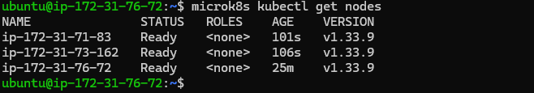
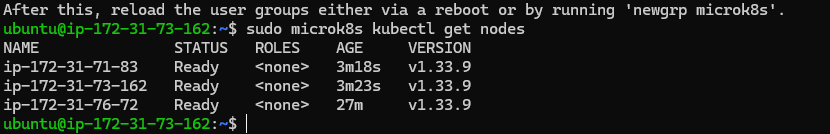
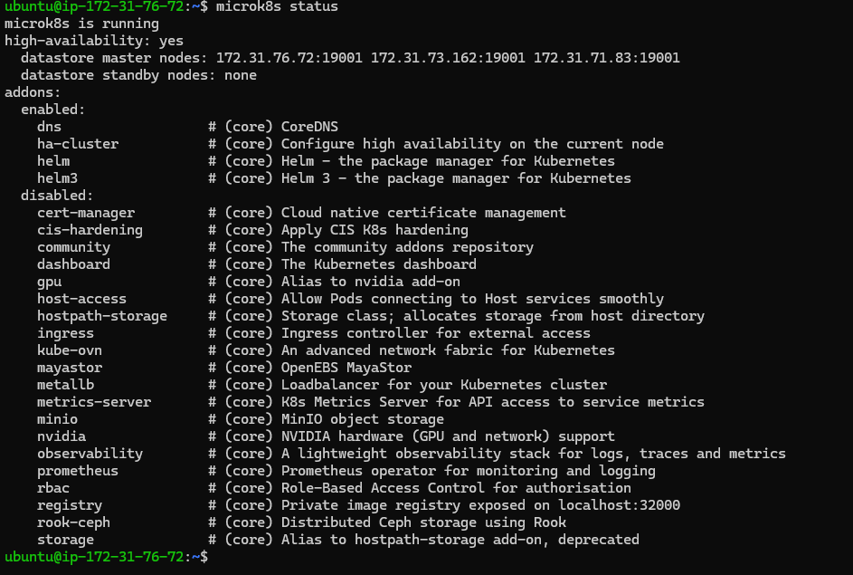
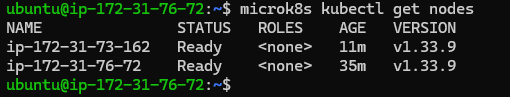
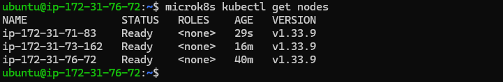
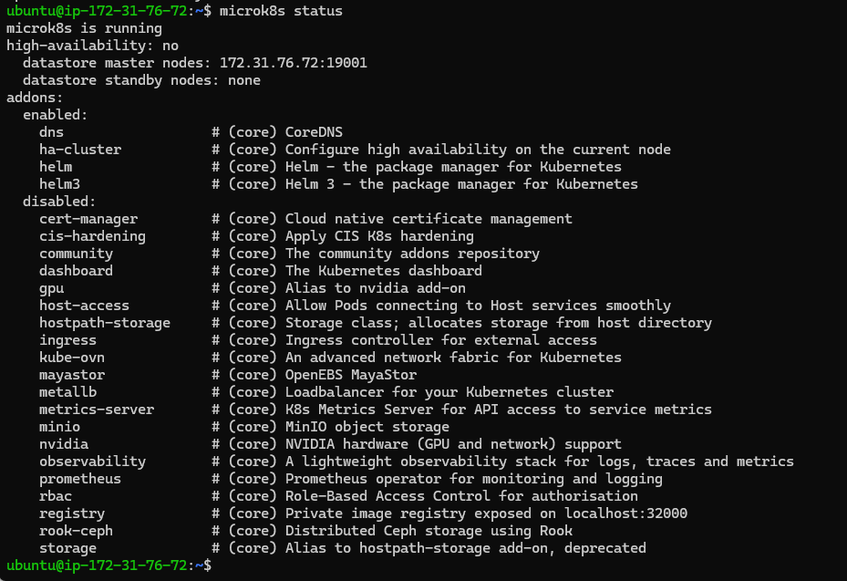
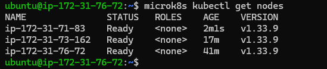
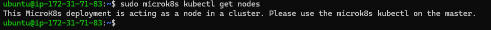

# KN06 – MicroK8s Dokumentation

---

## A) Installation

### Ziel dieser Aufgabe
Wir installieren MicroK8s auf drei AWS EC2 Instanzen und verbinden sie zu einem Kubernetes-Cluster. Das Ziel ist, einen funktionierenden Multi-Node-Cluster aufzubauen, der als Grundlage für KN07 dient.

Die drei EC2 Instanzen wurden auf AWS mit folgenden Einstellungen erstellt:
- AMI: Ubuntu Server 22.04 LTS
- Instance Typ: t3.medium
- Security Group: kn06-sg (SSH Port 22, HTTP Port 80, Port 25000, Port 16443, alle TCP innerhalb der gleichen Security Group)

| Node | Privat IP | Oeffentliche IP |
|---|---|---|
| node1 | 172.31.76.72 | 13.219.179.18 |
| node2 | 172.31.73.162 | 3.235.228.5 |
| node3 | 172.31.71.83 | 100.53.26.60 |

MicroK8s wurde auf allen drei Nodes mit folgendem Befehl installiert:

```bash
sudo snap install microk8s --classic
```

Node 2 und Node 3 wurden dem Cluster beigetreten mit:

```bash
sudo microk8s join 172.31.76.72:25000/<token>
```

### Befehl: `microk8s kubectl get nodes`

`microk8s kubectl` ist das in MicroK8s eingebettete Kubernetes-CLI-Tool. Der Unterbefehl `get nodes` fragt die Kubernetes-API nach allen registrierten Nodes im Cluster. Die Ausgabe zeigt Name, Status, Rolle, Alter und Kubernetes-Version jedes Nodes.

Wir fuehren ihn aus um zu ueberpruefen ob alle drei Nodes erfolgreich dem Cluster beigetreten sind und den Status `Ready` haben.

**Ausgefuehrt auf Node 1 (172.31.76.72):**



Alle drei Nodes sind mit Status `Ready` sichtbar. Der Cluster wurde erfolgreich gebildet.

---

## B) Verstaendnis fuer Cluster

### B1 – `get nodes` auf zweitem Node

Wir wollen verstehen ob jeder Node im Cluster dieselbe Sicht auf den Cluster hat. In einem verteilten System wie Kubernetes teilen sich alle Control-Plane-Nodes dieselbe Datenbasis (Dqlite). Der Test auf einem zweiten Node bestaetigt ob die Synchronisation funktioniert.

**Ausgefuehrt auf Node 2 (172.31.73.162):**



Die Ausgabe ist identisch zu Node 1. Das zeigt: Jeder Master-Node kennt den gesamten Cluster-Zustand, da alle auf dieselbe Cluster-Datenbank zugreifen und diese synchronisiert wird.

---

### B2 – `microk8s status` erklaeren

Mit `microk8s status` pruefen wir nicht nur ob MicroK8s laeuft, sondern auch ob High Availability (HA) aktiv ist. HA bedeutet, dass der Cluster auch dann weiterlaeuft wenn ein Node ausfaellt. Fuer HA braucht man mindestens 3 Nodes als Datastore-Master.

`microk8s status` zeigt den aktuellen Betriebszustand von MicroK8s auf dem lokalen Node mit folgenden Informationen:
- Ob MicroK8s laeuft
- Ob High Availability aktiv ist
- Welche Nodes Datastore-Master sind
- Welche Addons aktiviert sind

**Ausgefuehrt auf Node 1 (mit allen 3 Nodes als Control-Plane):**



| Zeile | Bedeutung |
|---|---|
| `microk8s is running` | MicroK8s laeuft korrekt auf diesem Node |
| `high-availability: yes` | HA ist aktiv - alle 3 Nodes verwalten gemeinsam die Cluster-Datenbank |
| `datastore master nodes: 172.31.76.72, 172.31.73.162, 172.31.71.83` | Alle 3 Nodes sind vollwertige Datastore-Master |
| `datastore standby nodes: none` | Kein reiner Standby noetig da alle 3 Nodes aktiv sind |

High Availability ist aktiv weil alle 3 Nodes als vollwertige Control-Plane-Nodes laufen und gemeinsam die Cluster-Datenbank via Raft-Algorithmus verwalten. Faellt ein Node aus uebernehmen die anderen zwei automatisch.

---

### B3 – Node entfernen

Wir wollen zeigen wie man einen Node aus dem Cluster entfernt. Das Entfernen geschieht in zwei Schritten: erst meldet sich der Node selbst ab, dann entfernt der Master ihn aus der Liste.

**Befehl 1 auf Node 3:**
```bash
sudo microk8s leave
```
`microk8s leave` wird auf dem Node ausgefuehrt der den Cluster verlassen soll. Der Node meldet sich sauber beim Cluster ab.

**Befehl 2 auf Node 1:**
```bash
microk8s remove-node ip-172-31-71-83
```
`microk8s remove-node` entfernt den angegebenen Node aus der Cluster-Registrierung.

**Ergebnis auf Node 1 nach dem Entfernen:**



Node 3 ist aus der Cluster-Liste entfernt. Danach sind nur noch 2 Nodes sichtbar.

---

### B4 – Node als Worker wieder hinzufuegen

Nicht jeder Node muss ein Master sein. Worker-Nodes sind spezialisiert auf das Ausfuehren von Pods, waehrend Master-Nodes die Verwaltungsaufgaben uebernehmen. Wir fuegen Node 3 diesmal als reinen Worker hinzu.

Zuerst wurde auf Node 1 ein neuer Token generiert:
```bash
microk8s add-node
```

Dann auf Node 3 als Worker beigetreten:
```bash
sudo microk8s join 172.31.76.72:25000/<token> --worker
```

Das Flag `--worker` sorgt dafuer dass der Node nur als Worker beitritt. Er bekommt keinen API-Server und keinen Zugang zur Cluster-Datenbank.

**Ergebnis auf Node 1:**



Node 3 ist dem Cluster als Worker-Node beigetreten.

---

### B5 – `microk8s status` nach Worker-Join

Nach dem Hinzufuegen von Node 3 als Worker wollen wir sehen wie sich der Status des Clusters veraendert hat.

**Ausgefuehrt auf Node 1 nach Worker-Join:**



| | Vorher (3x Control-Plane) | Nachher (2x Master, 1x Worker) |
|---|---|---|
| `high-availability` | yes | no |
| `datastore master nodes` | alle 3 IPs | nur Node 1 (172.31.76.72) |

High Availability ist auf `no` gefallen weil jetzt nur noch 2 Nodes die Cluster-Datenbank verwalten. Fuer HA braucht es mindestens 3 Datastore-Master. Der Worker-Node hat keinen Zugriff auf die Datenbank und zaehlt daher nicht.

---

### B6 – `get nodes` auf Master und Worker

Wir wollen praktisch zeigen warum `microk8s kubectl` nur auf Master-Nodes funktioniert. Der Befehl kommuniziert mit dem lokalen API-Server, und den gibt es nur auf Master-Nodes.

**Ausgefuehrt auf Master Node 1:**



Funktioniert normal, zeigt alle 3 Nodes.

**Ausgefuehrt auf Worker Node 3:**



Fehlermeldung:
```
This MicroK8s deployment is acting as a node in a cluster.
Please use the microk8s kubectl on the master.
```

Das stimmt mit `microk8s status` ueberein: Der Worker hat keinen lokalen API-Server und keine Verbindung zur Cluster-Datenbank. Da `microk8s kubectl` den lokalen API-Server benoetigt schlaegt der Befehl auf dem Worker fehl.

---

## Unterschied `microk8s` vs `microk8s kubectl`

`microk8s` ist das Verwaltungswerkzeug fuer die MicroK8s-Software selbst auf einem einzelnen Node. Es steuert den lokalen Betrieb (starten, stoppen, dem Cluster beitreten oder verlassen).

`microk8s kubectl` ist das Kubernetes-CLI-Tool das mit dem laufenden Kubernetes-Cluster kommuniziert. Es sendet Anfragen an den Kubernetes-API-Server und funktioniert deshalb nur auf Nodes die einen API-Server betreiben - also Master-Nodes.

| | `microk8s` | `microk8s kubectl` |
|---|---|---|
| Zweck | MicroK8s-Software auf dem Node verwalten | Kubernetes-Cluster verwalten |
| Kommuniziert mit | Lokalem MicroK8s-Daemon | Kubernetes-API-Server |
| Beispiele | `add-node`, `join`, `leave`, `status` | `get nodes`, `get pods`, `apply` |
| Auf Worker nutzbar? | Ja | Nein - kein lokaler API-Server |