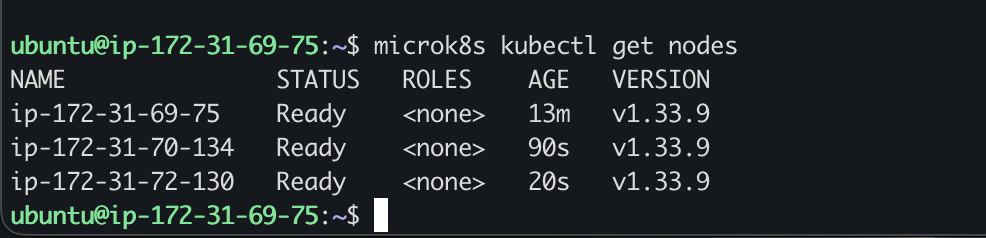
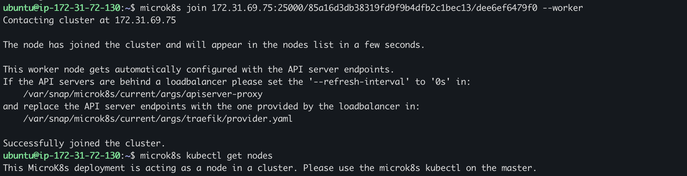
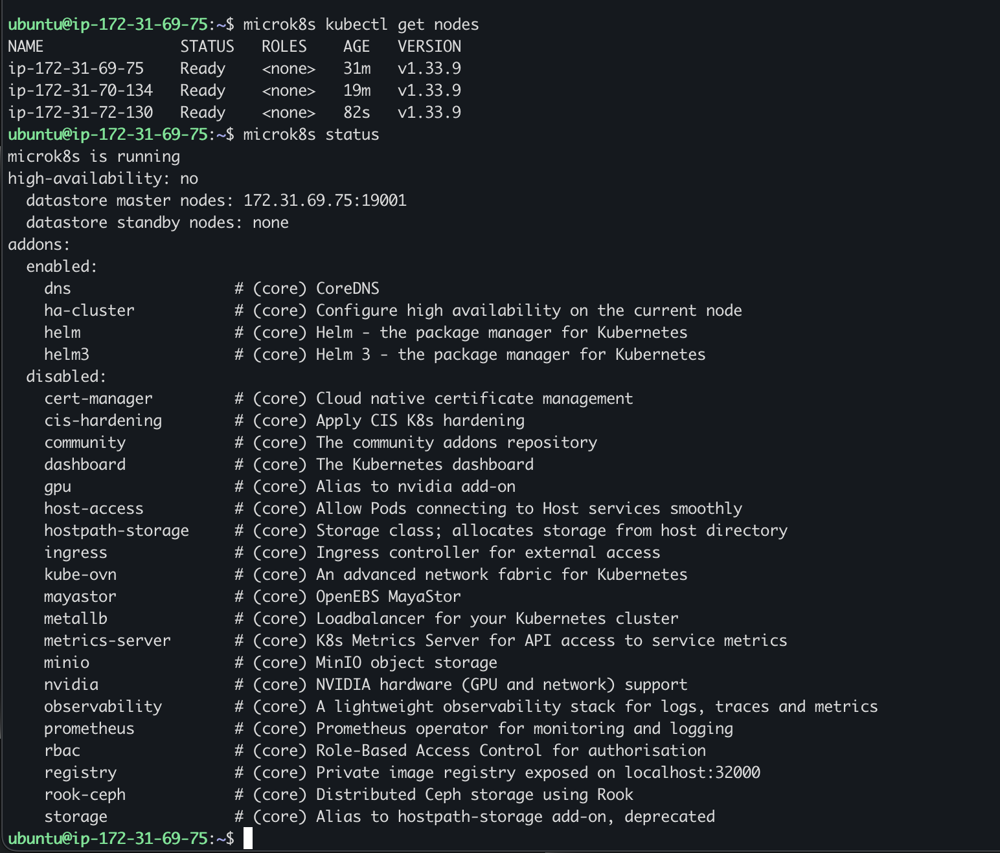

# KN06 – MicroK8s Dokumentation

---

## A) Installation

### Ziel dieser Aufgabe
Wir installieren MicroK8s auf drei AWS-Instanzen und verbinden sie zu einem Kubernetes-Cluster. Das Ziel ist, einen funktionierenden Multi-Node-Cluster aufzubauen, der als Grundlage für KN07 dient.

### Befehl: `microk8s kubectl get nodes`

**Was macht dieser Befehl?**
`microk8s kubectl` ist das in MicroK8s eingebettete Kubernetes-CLI-Tool (`kubectl`). Der Unterbefehl `get nodes` fragt die Kubernetes-API nach allen registrierten Nodes im Cluster. Die Ausgabe zeigt Name, Status, Rolle, Alter und Kubernetes-Version jedes Nodes.

**Warum führen wir ihn aus?**
Um zu überprüfen, ob alle drei Nodes erfolgreich dem Cluster beigetreten sind und den Status `Ready` haben – also betriebsbereit sind.

**Ausführung auf:** Node 1



**Ergebnis:** Alle drei Nodes sind mit Status `Ready` sichtbar. Der Cluster wurde erfolgreich gebildet.

---

## B) Verständnis für Cluster

### B1 – `get nodes` auf zweitem Node

**Warum machen wir das?**
Wir wollen verstehen, ob jeder Node im Cluster dieselbe Sicht auf den Cluster hat. In einem verteilten System wie Kubernetes teilen sich alle Control-Plane-Nodes dieselbe Datenbasis (etcd/Dqlite). Der Test auf einem zweiten Node bestätigt, ob die Synchronisation funktioniert.

### Befehl: `microk8s kubectl get nodes`

**Was macht dieser Befehl?**
Identisch zu A) – er fragt die Kubernetes-API nach allen Nodes. Da dieser Befehl nun auf einem anderen Node ausgeführt wird, können wir sehen, ob auch dieser Node Zugriff auf die vollständigen Cluster-Informationen hat.

**Ausführung auf:** Node 2 (ip-172-31-70-134)


**Ergebnis:** Die Ausgabe ist identisch zu Node 1. Das zeigt: Jeder Master-Node kennt den gesamten Cluster-Zustand, da alle auf dieselbe Cluster-Datenbank (Dqlite) zugreifen und diese synchronisiert wird.

---

### B2 – `microk8s status` erklären

**Warum machen wir das?**
Mit `microk8s status` prüfen wir nicht nur ob MicroK8s läuft, sondern auch ob High Availability (HA) aktiv ist. HA bedeutet, dass der Cluster auch dann weiterläuft, wenn ein Node ausfällt. Für HA braucht man mindestens 3 Nodes als Datastore-Master – das wollen wir hier bestätigen.

### Befehl: `microk8s status`

**Was macht dieser Befehl?**
`microk8s status` zeigt den aktuellen Betriebszustand von MicroK8s auf dem lokalen Node. Die wichtigsten Informationen stehen im Kopfbereich (vor "addons"):

- Ob MicroK8s läuft
- Ob High Availability aktiv ist
- Welche Nodes Datastore-Master bzw. Standby-Nodes sind
- Welche Addons aktiviert sind

**Ausführung auf:** Node 2 (mit allen 3 Nodes als Control-Plane)


**Erklärung der Ausgabe:**

| Zeile | Bedeutung |
|---|---|
| `microk8s is running` | MicroK8s läuft korrekt auf diesem Node |
| `high-availability: yes` | HA ist aktiv – alle 3 Nodes verwalten gemeinsam die Cluster-Datenbank |
| `datastore master nodes: ...` | Alle 3 Nodes sind vollwertige Datastore-Master (aktive Teilnehmer im Raft-Konsens) |
| `datastore standby nodes: none` | Kein reiner Standby nötig, da alle 3 Nodes aktiv sind |

**Fazit:** High Availability ist aktiv, weil alle 3 Nodes als vollwertige Control-Plane-Nodes laufen und gemeinsam die Cluster-Datenbank (via Raft-Algorithmus) verwalten. Fällt ein Node aus, übernehmen die anderen zwei automatisch – der Cluster bleibt verfügbar.

---

### B3 – Node entfernen

**Warum machen wir das?**
Wir wollen zeigen, wie man einen Node aus dem Cluster entfernt. Das ist in der Praxis notwendig, z.B. für Wartungsarbeiten oder wenn ein Node als Worker statt als Master konfiguriert werden soll (wie in B4). Das Entfernen geschieht in zwei Schritten: erst meldet sich der Node selbst ab, dann entfernt der Master ihn aus der Liste.

### Befehl 1: `microk8s leave` (auf Node 3)

**Was macht dieser Befehl?**
`microk8s leave` wird auf dem Node ausgeführt, der den Cluster verlassen soll. Der Node meldet sich sauber beim Cluster ab und stoppt seine Teilnahme an der Cluster-Datenbank.

### Befehl 2: `microk8s remove-node <IP>` (auf Node 1)

**Was macht dieser Befehl?**
`microk8s remove-node` wird auf einem verbleibenden Master-Node ausgeführt. Er entfernt den angegebenen Node aus der Cluster-Registrierung. Der Parameter ist die IP-Adresse oder der Hostname des zu entfernenden Nodes.

**Beispiel:** `microk8s remove-node ip-172-31-72-130`

**Ausführung:** Befehle auf Node 1


**Ergebnis:** Node 3 ist aus der Cluster-Liste entfernt. Danach sind nur noch 2 Nodes sichtbar.

---

### B4 – Node als Worker wieder hinzufügen

**Warum machen wir das?**
Nicht jeder Node muss ein Master sein. Worker-Nodes sind spezialisiert auf das Ausführen von Pods (Anwendungen), während Master-Nodes die Verwaltungsaufgaben (API-Server, Scheduler, Cluster-DB) übernehmen. Wir fügen Node 3 diesmal als reinen Worker hinzu, um diesen Unterschied zu zeigen.

### Befehl: `microk8s join <token> --worker`

**Was macht dieser Befehl?**
`microk8s join` verbindet einen Node mit einem bestehenden Cluster. Das Token wird vorher auf einem Master-Node mit `microk8s add-node` generiert und enthält die Adresse und einen Einmalschlüssel.

Der entscheidende Unterschied: Das Flag `--worker` sorgt dafür, dass der Node **nur als Worker** beitritt. Er bekommt:
- Keinen API-Server
- Keinen Zugang zur Cluster-Datenbank
- Keine Möglichkeit, `microk8s kubectl` auszuführen

**Ausführung auf:** Node 3



**Ergebnis:** Node 3 ist dem Cluster als Worker-Node beigetreten. Er kann Pods ausführen, aber keine Cluster-Befehle ausführen.

---

### B5 – `microk8s status` nach Worker-Join

**Warum machen wir das?**
Nach dem Hinzufügen von Node 3 als Worker wollen wir sehen, wie sich der Status des Clusters verändert hat – insbesondere ob High Availability noch aktiv ist.

### Befehl: `microk8s status`

**Was macht dieser Befehl?**
Gleich wie in B2 – zeigt den Betriebszustand und HA-Status. Diesmal vergleichen wir ihn mit dem vorherigen Zustand.

**Ausführung auf:** Node 1 (nach Worker-Join)



**Vergleich vorher / nachher:**

| | Vorher (3× Control-Plane) | Nachher (2× Master, 1× Worker) |
|---|---|---|
| `high-availability` | **yes** | **no** |
| `datastore master nodes` | alle 3 IPs | nur Node 1 |

**Erklärung:** High Availability ist auf `no` gefallen, weil jetzt nur noch 2 Nodes die Cluster-Datenbank verwalten. Für HA braucht es **mindestens 3 Datastore-Master** (Raft-Konsens benötigt eine Mehrheit, um Entscheidungen zu treffen – bei 2 Nodes ist keine Mehrheit bei Ausfall möglich). Der Worker-Node hat keinen Zugriff auf die Datenbank und zählt daher nicht.

---

### B6 – `get nodes` auf Master und Worker

**Warum machen wir das?**
Wir wollen praktisch zeigen, warum `microk8s kubectl` nur auf Master-Nodes funktioniert. Das hängt direkt mit der Architektur zusammen: Der Befehl kommuniziert mit dem lokalen API-Server, und den gibt es nur auf Master-Nodes.

### Befehl: `microk8s kubectl get nodes`

**Was macht dieser Befehl?**
Gleich wie in A) und B1 – Abfrage aller Nodes über die Kubernetes-API. Der Unterschied liegt darin, **wo** der Befehl ausgeführt wird.

**Ausführung auf:** Master (Node 1) und Worker (Node 3)


**Ergebnis auf dem Master:** Funktioniert normal, zeigt alle 3 Nodes.

**Ergebnis auf dem Worker:** Fehlermeldung:
```
This MicroK8s deployment is acting as a node in a cluster.
Please use the microk8s kubectl on the master.
```

**Warum stimmt das mit `microk8s status` überein?**
`microk8s status` zeigt für den Worker-Node keinen Eintrag bei `datastore master nodes`. Das bedeutet: Der Worker hat keinen lokalen API-Server und keine Verbindung zur Cluster-Datenbank. Da `microk8s kubectl` den lokalen API-Server benötigt, schlägt der Befehl auf dem Worker fehl. Beides – der Status-Output und der fehlgeschlagene kubectl-Befehl – bestätigen dasselbe: Der Worker ist kein Control-Plane-Node.

---

## Unterschied `microk8s` vs `microk8s kubectl`

**`microk8s`** ist das Verwaltungswerkzeug für die MicroK8s-**Software selbst** auf einem einzelnen Node. Es steuert den lokalen Betrieb (starten, stoppen, dem Cluster beitreten oder verlassen) und hat nichts mit dem laufenden Kubernetes-Cluster zu tun.

**`microk8s kubectl`** ist das Kubernetes-CLI-Tool (`kubectl`), das mit dem laufenden **Kubernetes-Cluster** kommuniziert. Es sendet Anfragen an den Kubernetes-API-Server und funktioniert deshalb nur auf Nodes, die einen API-Server betreiben – also Master-Nodes.

| | `microk8s` | `microk8s kubectl` |
|---|---|---|
| Zweck | MicroK8s-Software auf dem Node verwalten | Kubernetes-Cluster verwalten |
| Kommuniziert mit | Lokalem MicroK8s-Daemon | Kubernetes-API-Server |
| Beispiele | `add-node`, `join`, `leave`, `status`, `start`, `stop` | `get nodes`, `get pods`, `apply`, `describe` |
| Auf Worker nutzbar? | Ja | Nein – kein lokaler API-Server |
| Vergleich | Wie `systemctl` für einen Dienst | Wie ein Admin-Panel für den Cluster |