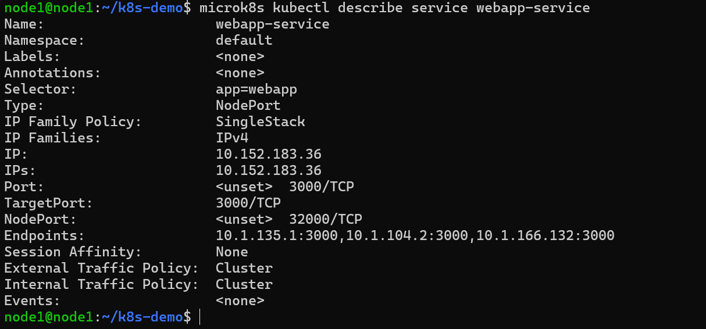

# KN07: Kubernetes II

---

## A) Begriffe und Konzepte

### Unterschied zwischen Pods und Replicas

Ein **Pod** ist die kleinste ausfuehrbare Einheit in Kubernetes. Er ist ein Wrapper um einen oder mehrere Container, die zusammen auf demselben Node laufen und sich Netzwerk sowie Speicher teilen.

Das Problem: Stirbt ein Pod, ist er weg. Kubernetes startet ihn nicht automatisch neu wenn man ihn alleine deployed.

Eine **Replica** beschreibt wie viele identische Kopien eines Pods gleichzeitig laufen sollen. Kubernetes ueberwacht das kontinuierlich. Stirbt einer der Pods, erstellt Kubernetes automatisch einen neuen um die gewuenschte Anzahl wieder zu erreichen.

- **Pod** = eine einzelne laufende Instanz der Anwendung
- **Replica** = die gewuenschte Anzahl solcher Instanzen die Kubernetes aufrechterhalten soll

---

### Unterschied zwischen Service und Deployment

Ein **Deployment** sorgt dafuer dass die Anwendung laeuft. Es verwaltet Pods, sorgt fuer die gewuenschte Anzahl Replicas und ermoeglight Rolling Updates oder Rollbacks.

Ein **Service** loest ein anderes Problem: Pods sind vergaenglich. Sie sterben, werden neu erstellt und bekommen dabei jedes Mal eine neue IP-Adresse. Ein Service ist eine stabile Netzwerkadresse die vor den Pods steht. Er weiss anhand von Labels welche Pods zu ihm gehoeren und leitet den Traffic weiter.

- **Deployment** = sorgt dafuer dass die richtigen Pods in der richtigen Anzahl laufen
- **Service** = sorgt dafuer dass man diese Pods stabil erreichen kann

---

### Welches Problem loest Ingress?

Ohne Ingress braucht man fuer jeden Service der nach aussen exponiert werden soll einen eigenen LoadBalancer oder NodePort. Das bedeutet bei 10 Services: 10 separate externe IP-Adressen und hohe Kosten.

Ingress ist ein einziger Einstiegspunkt in den Cluster der eingehenden HTTP/HTTPS-Traffic anhand von Regeln an die richtigen Services weiterleitet - alles ueber eine einzige externe IP-Adresse.

---

### Wofuer ist ein StatefulSet?

Ein StatefulSet ist wie ein Deployment, aber fuer Anwendungen bei denen jede Instanz eine eigene Identitaet und eigene Daten hat die erhalten bleiben muessen. Jeder Pod bekommt einen stabilen Namen und eigenen persistenten Speicher.

Beispiel: Eine MongoDB im Cluster sollte als StatefulSet betrieben werden, weil die Daten nach einem Neustart erhalten bleiben muessen.

---

## B) Demo Projekt

### Cluster-Aufbau

Der Kubernetes Cluster besteht aus 3 AWS EC2 Instanzen mit Ubuntu Server auf denen MicroK8s installiert wurde.

| Node | Private IP | Oeffentliche IP | Rolle |
|------|------------|-----------------|-------|
| node1 | 172.31.76.72 | 98.92.66.169 | Control Plane |
| node2 | 172.31.73.162 | 3.237.1.238 | Control Plane |
| node3 | 172.31.71.83 | 100.48.74.45 | Control Plane |

---

### Welcher Teil wurde nicht wie im Tutorial umgesetzt? (Datenbank)

Die MongoDB wurde nicht als StatefulSet deployed sondern als normales Deployment. Datenbanken sollten eigentlich als StatefulSet betrieben werden weil jede Instanz eigenen persistenten Speicher benoetigt.

In diesem Demo-Projekt wurde MongoDB als Deployment mit einer einzigen Replica deployt ohne persistenten Speicher (kein PersistentVolumeClaim). Das bedeutet: Wenn der MongoDB-Pod neu startet gehen alle Daten verloren. Fuer dieses Demo-Projekt reicht es jedoch aus.

---

### Warum ist der MongoUrl-Wert in der ConfigMap korrekt?

```yaml
data:
  mongo-url: mongo-service
```

Dieser Wert ist korrekt weil Kubernetes intern ein DNS-System betreibt. Jeder Service ist innerhalb des Clusters unter seinem Namen erreichbar. Da der MongoDB-Service den Namen `mongo-service` traegt kann die WebApp ihn ueber genau diesen Namen ansprechen ohne eine IP-Adresse zu kennen.

---

### Deployment der Anwendung

Folgende YAML-Dateien wurden erstellt und deployt:

- `mongo-config.yaml` - MongoDB URL Konfiguration (ConfigMap)
- `mongo-secret.yaml` - MongoDB Benutzername und Passwort (Base64-kodiert)
- `mongo.yaml` - MongoDB Deployment und ClusterIP Service
- `webapp.yaml` - WebApp Deployment und NodePort Service

```bash
microk8s kubectl apply -f mongo-config.yaml
microk8s kubectl apply -f mongo-secret.yaml
microk8s kubectl apply -f mongo.yaml
microk8s kubectl apply -f webapp.yaml
```

Laufende Pods nach dem Deployment:


---

### webapp-service auf Node 1

Der Befehl `microk8s kubectl describe service webapp-service` zeigt alle Details des webapp-service an wie Typ, IP, Port, NodePort und die Endpoints.

```bash
microk8s kubectl describe service webapp-service
```


---

### webapp-service auf Node 2

Der gleiche Befehl auf Node 2 ausgefuehrt. Die Ausgabe ist identisch da alle Nodes im Cluster dieselbe Konfiguration sehen.


---

### mongo-service auf Node 1

```bash
microk8s kubectl describe service mongo-service
```


**Unterschiede zwischen webapp-service und mongo-service:**

Der webapp-service ist vom Typ `NodePort` und ist von aussen erreichbar. Der mongo-service ist vom Typ `ClusterIP` und nur innerhalb des Clusters erreichbar. Die Datenbank soll nicht direkt von aussen zugaenglich sein sondern nur von der WebApp intern angesprochen werden.

---

### Webseite ueber zwei Nodes aufrufen

Die Webseite ist ueber den NodePort auf jeder Node-IP erreichbar. Um die Webseite aufzurufen wird die IP-Adresse eines Nodes mit dem NodePort kombiniert.

**Node 1 (98.92.66.169):**


**Node 2 (3.237.1.238):**


---

### MongoDB Compass Verbindung

Eine direkte Verbindung von MongoDB Compass auf dem lokalen PC zum MongoDB-Pod ist nicht moeglich. Der Grund: Der mongo-service ist vom Typ `ClusterIP` und nur innerhalb des Kubernetes-Clusters erreichbar.

**Was man aendern muesste damit es geht:**

Man koennte den mongo-service auf den Typ `NodePort` aendern und einen NodePort definieren. Dann waere MongoDB von aussen erreichbar. In einem Produktionssystem wuerde man dies aus Sicherheitsgruenden jedoch nicht tun da Datenbanken nie direkt nach aussen exponiert werden sollten.

---

### Port auf 32000 aendern und Replicas auf 3 erhoehen

In der Datei `webapp.yaml` wurden zwei Aenderungen gemacht:

1. `nodePort: 30100` auf `nodePort: 32000` geaendert
2. `replicas: 1` auf `replicas: 3` geaendert

```bash
microk8s kubectl apply -f webapp.yaml
```

Kubernetes erkennt die Aenderungen und aktualisiert nur die betroffenen Ressourcen ohne alles neu zu erstellen.

**webapp-service nach der Aenderung:**

```bash
microk8s kubectl describe service webapp-service
```



Man sieht zwei Unterschiede zum vorherigen Screenshot: Der NodePort ist jetzt `32000/TCP` und unter Endpoints sind drei IP-Adressen aufgefuehrt was den drei laufenden Replicas entspricht.

**Webseite ueber Port 32000:**

