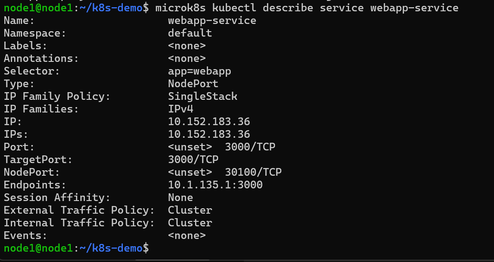
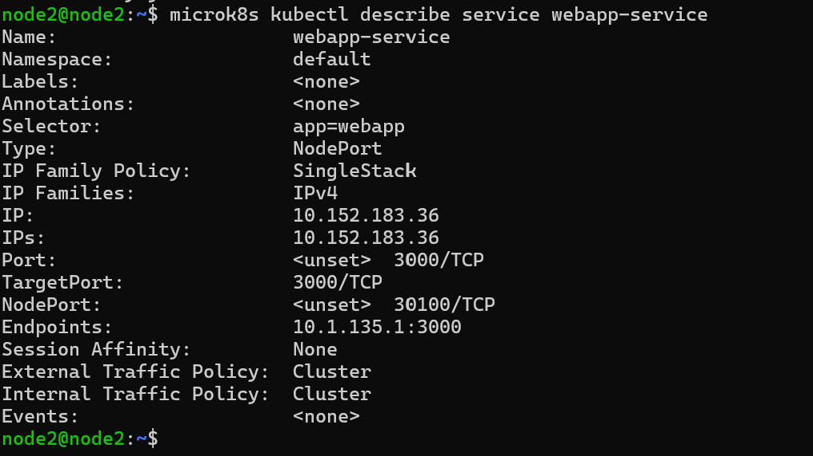
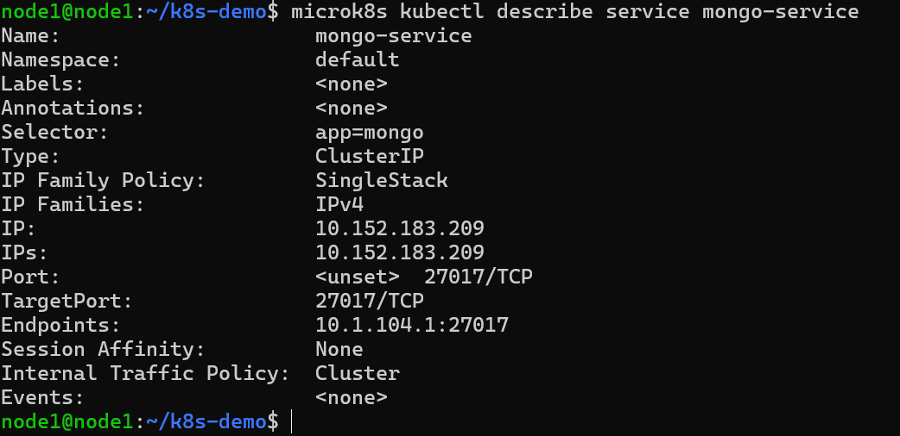
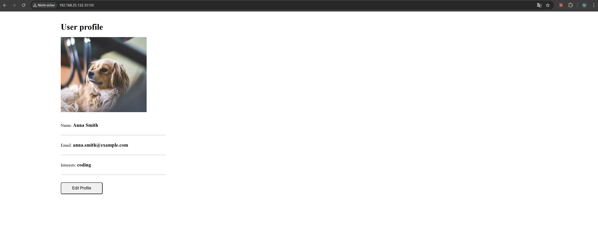

# KN07: Kubernetes II

---

## A) Begriffe und Konzepte

### Unterschied zwischen Pods und Replicas

**Pod** ist die kleinste ausführbare Einheit in Kubernetes. Ein Pod ist ein "Wrapper" um einen oder mehrere Container, die zusammen auf demselben Node laufen und sich Netzwerk sowie Speicher teilen. Man kann sich einen Pod wie einen einzelnen "Prozess" oder eine einzelne Instanz der Anwendung vorstellen.

Das Problem: Stirbt ein Pod (Absturz, Node-Fehler), ist er weg. Kubernetes startet ihn nicht automatisch neu, wenn man ihn alleine deployed.

**Replica** ist kein eigenständiges Objekt, sondern ein Konzept innerhalb eines ReplicaSets (oder Deployments). Es beschreibt, wie viele identische Kopien eines Pods gleichzeitig laufen sollen. Man sagt Kubernetes quasi: "Ich will immer 3 Instanzen dieses Pods am Leben haben." Kubernetes überwacht das dann kontinuierlich. Stirbt einer der Pods, erstellt Kubernetes automatisch einen neuen, um die gewünschte Anzahl wieder zu erreichen.

**Kurz zusammengefasst:**

- **Pod** = eine einzelne laufende Instanz der Anwendung
- **Replica** = die gewünschte Anzahl solcher Instanzen, die Kubernetes aufrechterhalten soll

Ein Pod ist das *Was*, eine Replica-Anzahl ist das *Wie viele*. Ohne Replicas hat man eine fragile Einzelinstanz. Mit Replicas bekommt man Selbstheilung und Hochverfügbarkeit.

---

### Unterschied zwischen Service und Deployment

**Deployment** ist zuständig dafür, dass die Anwendung läuft. Es verwaltet Pods, sorgt dafür dass die gewünschte Anzahl Replicas am Leben ist, und ermöglicht Rolling Updates oder Rollbacks. Ein Deployment kümmert sich also um den Lebenszyklus der Pods.

**Service** löst ein anderes Problem: Pods sind vergänglich. Sie sterben, werden neu erstellt, bekommen dabei jedes Mal eine neue IP-Adresse. Wie soll ein anderer Pod oder ein externer Nutzer wissen, unter welcher Adresse er die Anwendung erreicht?

Ein Service ist eine stabile Netzwerkadresse, die vor den Pods steht. Er weiss anhand von Labels, welche Pods zu ihm gehören, und leitet den Traffic an diese weiter. Die IP des Services ändert sich nie, egal wie oft die dahinterliegenden Pods neu gestartet werden.

**Kurz zusammengefasst:**

- **Deployment** = kümmert sich darum, dass die richtigen Pods in der richtigen Anzahl laufen
- **Service** = kümmert sich darum, dass man diese Pods stabil erreichen kann

Ein Deployment ohne Service bedeutet: Die Anwendung läuft, aber niemand kann sie zuverlässig ansprechen. Ein Service ohne Deployment wäre eine Adresse, die ins Leere zeigt.

---

### Welches Problem löst Ingress?

Ohne Ingress hat man das folgende Problem: Für jeden Service, den man nach aussen exponieren will, braucht man einen eigenen LoadBalancer oder NodePort. Das bedeutet bei 10 Services: 10 separate externe IP-Adressen, 10 Cloud-Loadbalancer, hohe Kosten und schwer zu verwaltende Konfiguration.

**Ingress** ist ein einziger Einstiegspunkt in den Cluster, der eingehenden HTTP/HTTPS-Traffic anhand von Regeln an die richtigen Services weiterleitet. Man kann zum Beispiel sagen:

- `api.meineapp.ch` geht an den API-Service
- `meineapp.ch/shop` geht an den Shop-Service
- `meineapp.ch/admin` geht an den Admin-Service

Das alles läuft über eine einzige externe IP-Adresse und einen einzigen Ingress-Controller.

**Kurz gesagt:**

Ingress löst das Problem, dass man viele Services mit einer einzigen externen Adresse erreichbar machen will, ohne für jeden Service separate Infrastruktur zu betreiben. Es ist quasi der "Reverse Proxy" des Clusters, der entscheidet, welcher Traffic wohin geht.

---

### Wofür ist ein StatefulSet?

Ein StatefulSet ist wie ein Deployment, aber für Anwendungen, bei denen jede Instanz eine eigene Identität und eigene Daten hat, die erhalten bleiben müssen.

Bei einem normalen Deployment sind alle Pods austauschbar. Es ist egal welcher Pod stirbt und neu startet, sie sind alle identisch und haben keinen eigenen persistenten Zustand.

Bei einem StatefulSet hingegen:
- bekommt jeder Pod einen stabilen, vorhersehbaren Namen (z.B. `app-0`, `app-1`, `app-2`)
- bekommt jeder Pod seinen eigenen persistenten Speicher, der auch nach einem Neustart wieder mit genau diesem Pod verbunden wird
- werden Pods in einer festen Reihenfolge gestartet und gestoppt

**Beispiel: Elasticsearch Cluster**

Elasticsearch ist eine Such- und Analyse-Engine, die oft als Cluster mit mehreren Knoten betrieben wird. Dabei ist jeder Knoten kein beliebiger austauschbarer Pod:

- Knoten `elastic-0` ist der Master-Knoten
- Knoten `elastic-1` und `elastic-2` sind Data-Knoten

Jeder Knoten hat seinen eigenen Index-Daten-Speicher. Würde man `elastic-1` neu starten, muss er wieder mit exakt seinen eigenen Daten verbunden werden und nicht mit denen von `elastic-0`. Ausserdem müssen die anderen Knoten im Cluster ihn unter dem gleichen Namen wieder finden können.

**Kurz gesagt:**

StatefulSet ist für Anwendungen, bei denen Pods keine austauschbaren Kopien sind, sondern individuelle Mitglieder eines Systems mit eigener Identität und eigenem Zustand.

---

## B) Demo Projekt

### Cluster-Aufbau

Der Kubernetes Cluster besteht aus 3 Virtual Machines mit Ubuntu Server, auf denen jeweils MicroK8s installiert wurde. Node1 übernimmt die Rolle des Control Plane (Master), Node2 und Node3 sind Worker Nodes.

| Node  | IP-Adresse      | Rolle         |
|-------|-----------------|---------------|
| node1 | 192.168.25.132  | Control Plane |
| node2 | 192.168.25.133  | Worker        |
| node3 | 192.168.25.134  | Worker        |

---

### Abgaben und Erklärungen

#### Welcher Teil wurde nicht wie im Tutorial umgesetzt und warum? (Datenbank)

Die MongoDB wurde nicht als StatefulSet deployed, sondern als normales Deployment. Im Tutorial und in den Begrifflichkeiten wurde erklärt, dass Datenbanken eigentlich als StatefulSet betrieben werden sollten, weil jede Instanz eine eigene Identität und eigenen persistenten Speicher benötigt.

In diesem Demo-Projekt wurde MongoDB als Deployment mit einer einzigen Replica deployt, ohne persistenten Speicher (kein PersistentVolumeClaim). Das bedeutet: Wenn der MongoDB-Pod neu startet, gehen alle Daten verloren. Für ein Produktionssystem wäre das nicht akzeptabel, aber für dieses Demo-Projekt reicht es aus, da es nur darum geht, die Funktionsweise von Kubernetes zu zeigen und keine echten Daten langfristig gespeichert werden müssen.

#### Warum ist der MongoUrl-Wert in der ConfigMap korrekt?

In der `ConfigMap.yaml` ist die `mongo-url` auf den Wert `mongo-service` gesetzt:

```yaml
data:
  mongo-url: mongo-service
```

Dieser Wert ist korrekt, weil Kubernetes intern ein DNS-System betreibt. Jeder Service ist innerhalb des Clusters unter seinem Namen erreichbar. Da der MongoDB-Service in der `DeploymentAndServiceMongoDB.yaml` den Namen `mongo-service` trägt, kann die WebApp ihn über genau diesen Namen ansprechen, ohne eine IP-Adresse zu kennen. Kubernetes löst `mongo-service` automatisch zur internen Cluster-IP des Services auf.

---

### Deployment der Anwendung

Die YAML-Konfigurationsdateien wurden erstellt und auf den Cluster angewendet. Folgende Dateien wurden deployt:

- `ConfigMap.yaml` - MongoDB URL Konfiguration
- `Secret.yaml` - MongoDB Benutzername und Passwort (Base64-kodiert)
- `DeploymentAndServiceMongoDB.yaml` - MongoDB Deployment und ClusterIP Service
- `DeploymentAndServiceWebApp.yaml` - WebApp Deployment und NodePort Service

```bash
microk8s kubectl apply -f .
```

Dieser Befehl wendet alle YAML-Dateien im aktuellen Verzeichnis auf den Cluster an. Kubernetes erstellt daraufhin alle definierten Ressourcen (ConfigMap, Secret, Deployments, Services).

---

### Screenshot 1: webapp-service auf node1

Der Befehl `microk8s kubectl describe service webapp-service` zeigt alle Details des webapp-service an, wie Typ, IP, Port, NodePort und die Endpoints (laufende Pods).



---

### Screenshot 2: webapp-service auf node2

Der gleiche Befehl wurde auf node2 ausgeführt. Die Ausgabe ist identisch, da alle Nodes im Cluster dieselbe Konfiguration sehen. Das zeigt, dass der Cluster korrekt synchronisiert ist.



---

### Screenshot 3: mongo-service auf node1

```bash
microk8s kubectl describe service mongo-service
```



**Unterschiede zwischen webapp-service und mongo-service:**

Der webapp-service ist vom Typ `NodePort`, der mongo-service vom Typ `ClusterIP`. Das bedeutet, der webapp-service ist von aussen über einen bestimmten Port (30100) erreichbar, da er nach aussen exponiert werden soll. Der mongo-service hingegen ist nur innerhalb des Clusters erreichbar (ClusterIP), weil die Datenbank nicht direkt von aussen zugänglich sein soll, sondern nur von der WebApp intern angesprochen wird. Ausserdem hat der mongo-service keinen NodePort, was man in der Ausgabe daran erkennt, dass dieses Feld fehlt.

---

### Screenshot 4 und 5: Webseite über zwei Nodes

Die Webseite ist über den NodePort 30100 auf jeder Node-IP erreichbar. Die Service-Konfiguration des webapp-service gibt mit `nodePort: 30100` und `type: NodePort` Auskunft darüber, über welchen Port die App von aussen erreichbar ist.

Um die Webseite aufzurufen, musste die IP-Adresse eines Nodes mit dem NodePort kombiniert werden:

- `http://192.168.25.132:30100` (node1)
- `http://192.168.25.133:30100` (node2)




---

### MongoDB Compass Verbindung

Eine direkte Verbindung von MongoDB Compass auf dem lokalen PC zum MongoDB-Pod ist nicht möglich. Der Grund: Der mongo-service ist vom Typ `ClusterIP`, was bedeutet er ist nur innerhalb des Kubernetes-Clusters erreichbar. Von aussen gibt es keinen offenen Port.

**Was man ändern müsste damit es geht:**

Man könnte den mongo-service auf den Typ `NodePort` ändern und einen NodePort (z.B. 32017) definieren. Dann wäre MongoDB über `192.168.25.132:32017` von aussen erreichbar. Alternativ könnte man im MongoDB-Deployment einen `hostPort` konfigurieren. In einem Produktionssystem würde man dies aus Sicherheitsgründen jedoch nicht tun, da Datenbanken nie direkt nach aussen exponiert werden sollten.

---

### Port auf 32000 ändern und Replicas auf 3 erhöhen

**Durchgeführte Schritte:**

In der Datei `DeploymentAndServiceWebApp.yaml` wurden zwei Änderungen gemacht:

1. In der Service-Definition: `nodePort: 30100` auf `nodePort: 32000` geändert
2. In der Deployment-Definition: `replicas: 1` auf `replicas: 3` geändert

```bash
nano DeploymentAndServiceWebApp.yaml
```

Dieser Befehl öffnet den Texteditor nano, um die Datei zu bearbeiten. Nach dem Speichern wurde die Änderung angewendet:

```bash
microk8s kubectl apply -f .
```

Kubernetes erkennt die Änderungen und aktualisiert nur die betroffenen Ressourcen, ohne alles neu zu erstellen.

---

### Screenshot 6: Webseite nach Änderung (Port 32000)

Die Webseite ist nun über Port 32000 erreichbar:


---

### Screenshot 7: webapp-service nach Änderung

```bash
microk8s kubectl describe service webapp-service
```


**Unterschied zu Screenshot 1:**

Im Vergleich zum ersten Screenshot sieht man zwei Unterschiede. Erstens ist der `NodePort` jetzt `32000/TCP` statt `30100/TCP`. Zweitens sind unter `Endpoints` jetzt drei IP-Adressen aufgeführt statt einer, was den drei laufenden Replicas entspricht. Jede Endpoint-IP gehört zu einem eigenen webapp-Pod, auf den der Service den Traffic verteilt.