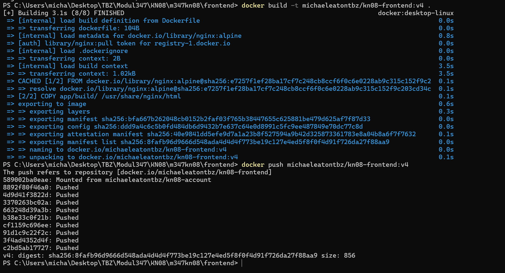

# KN08: Kubernetes III - Microservices

## Uebersicht

In diesem Auftrag wurde eine Microservice-Applikation fuer eine Crypto-Exchange-Plattform (tbzCoin) implementiert und in Kubernetes deployt. Die Applikation besteht aus 4 Microservices:

- **Frontend** (React App) - vorgegeben
- **Account** (.NET Service) - vorgegeben
- **BuySell** (Node.js) - selbst implementiert
- **SendReceive** (Node.js) - selbst implementiert

---

## Schritt 1: Datenbank erstellen (AWS RDS)

Die Datenbank wurde als MariaDB-Instanz auf AWS RDS erstellt. AWS RDS ist ein verwalteter Datenbankdienst von Amazon, der es erlaubt Datenbanken ohne eigene Server zu betreiben.

In der AWS Console wurde unter RDS eine neue MariaDB-Instanz mit folgenden Einstellungen erstellt:
- DB Identifier: `kn08-db`
- Engine: MariaDB
- Template: Free tier
- Public access: Yes


Die Datenbank ist mit Status **Verfuegbar** bereit.

Der Endpoint der Datenbank lautet `kn08-db.c36osqe2crs9.us-east-1.rds.amazonaws.com`:


### SQL-Script einspielen

Das initiale SQL-Script wurde auf Node 1 eingespielt. Der folgende Befehl verbindet sich mit der RDS-Datenbank und fuehrt das Script aus:

```bash
mysql -h kn08-db.c36osqe2crs9.us-east-1.rds.amazonaws.com -P 3306 -u admin -p < ~/m347kn08/database/m347_KN08_DB.sql
```

Anschliessend wurde die Datenbank geprueft:

```sql
USE m347kn08;
SHOW TABLES;
SELECT * FROM users;
SELECT * FROM friends;
```


Die Datenbank enthaelt die Tabellen `users` und `friends` mit Beispieldaten. User 1 (Rene) hat 30 tbzCoins.

---

## Schritt 2: Frontend builden und containerisieren

Das Frontend ist eine React-App. Zuerst wurden die Environment-Variablen in `.env.production` gesetzt, damit das Frontend die korrekten Service-URLs verwendet:

```
REACT_APP_ACCOUNT_HOLDINGS=http://192.168.25.132:30080/Account/Cryptos/?userid=<userId>
REACT_APP_ACCOUNT_FRIENDS=http://192.168.25.132:30080/Account/Friends/?userid=<userId>
REACT_APP_BUYSELL_BUY=http://192.168.25.132:30002/buy
REACT_APP_BUYSELL_SELL=http://192.168.25.132:30002/sell
REACT_APP_SENDRECEIVE_SEND=http://192.168.25.132:30003/send
REACT_APP_USER_LOGGED_IN=1
```

Dann wurde die App gebaut und in einen Container gepackt:

```bash
npm install
npm run build
docker build -t michaeleatontbz/kn08-frontend:v1 .
docker push michaeleatontbz/kn08-frontend:v1
```


Das Image wurde erfolgreich auf Docker Hub gepusht.

---

## Schritt 3: Account-Komponente containerisieren

Der Account Service ist in .NET geschrieben und bereits vorgegeben. Zuerst wurde die `appsettings.json` mit dem RDS-ConnectionString konfiguriert:

```json
{
  "ConnectionString": "Server=kn08-db.c36osqe2crs9.us-east-1.rds.amazonaws.com;Database=m347kn08;User ID=admin;Password=Admin1234!;"
}
```

Dann wurde der Container gebaut und gepusht:

```bash
docker build -t michaeleatontbz/kn08-account:v1 .
docker push michaeleatontbz/kn08-account:v1
```


---

## Schritt 6: BuySell und SendReceive implementieren

### BuySell Service

Der BuySell Service wurde in Node.js implementiert. Er stellt zwei Endpoints zur Verfuegung:

- `POST /buy` - Kauft tbzCoins fuer einen Benutzer
- `POST /sell` - Verkauft tbzCoins eines Benutzers

```javascript
const express = require('express');
const axios = require('axios');
const app = express();
app.use(express.json());

const ACCOUNT_URL = process.env.ACCOUNT_URL || 'http://localhost:8080';

app.post('/buy', async (req, res) => {
  const { id, amount } = req.body;
  const response = await axios.post(`${ACCOUNT_URL}/Account/Cryptos/Add`, { userId: id, amount: amount });
  res.json(response.data);
});

app.post('/sell', async (req, res) => {
  const { id, amount } = req.body;
  const balanceRes = await axios.get(`${ACCOUNT_URL}/Account/Cryptos/?userid=${id}`);
  const currentBalance = balanceRes.data.amount;
  const actualAmount = currentBalance >= amount ? amount : currentBalance;
  const response = await axios.post(`${ACCOUNT_URL}/Account/Cryptos/Subtract`, { userId: id, amount: actualAmount });
  res.json(response.data);
});

app.listen(8002, () => console.log('BuySell running on port 8002'));
```

### SendReceive Service

Der SendReceive Service ermoeglicht das Senden von tbzCoins an Freunde:

- `POST /send` - Sendet tbzCoins an einen Freund

```javascript
const express = require('express');
const axios = require('axios');
const app = express();
app.use(express.json());

const ACCOUNT_URL = process.env.ACCOUNT_URL || 'http://localhost:8080';

app.post('/send', async (req, res) => {
  const { id, receiverId, amount } = req.body;

  const friendsRes = await axios.get(`${ACCOUNT_URL}/Account/Friends/?userid=${id}`);
  const isFriend = friendsRes.data.some(f => f.id === receiverId);
  if (!isFriend) return res.status(400).json({ error: 'Not a friend' });

  const balanceRes = await axios.get(`${ACCOUNT_URL}/Account/Cryptos/?userid=${id}`);
  if (balanceRes.data.amount < amount) return res.status(400).json({ error: 'Not enough coins' });

  await axios.post(`${ACCOUNT_URL}/Account/Cryptos/Subtract`, { userId: id, amount });
  await axios.post(`${ACCOUNT_URL}/Account/Cryptos/Add`, { userId: receiverId, amount });

  res.json({ success: true });
});

app.listen(8003, () => console.log('SendReceive running on port 8003'));
```

---

## Schritt 7: Kubernetes Deployment

### ConfigMap

Die ConfigMap speichert die URL des Account-Services, damit BuySell und SendReceive ihn finden koennen. Kubernetes injiziert diese Werte als Umgebungsvariablen in die Container:

```yaml
apiVersion: v1
kind: ConfigMap
metadata:
  name: crypto-config
data:
  ACCOUNT_URL: "http://account-service:8080"
```

### Deployments und Services

Fuer jeden Microservice wurde ein Deployment und ein Service erstellt. Das Deployment definiert wie viele Replicas laufen sollen und welches Image verwendet wird. Der Service macht den Pod im Netzwerk erreichbar.

```yaml
apiVersion: apps/v1
kind: Deployment
metadata:
  name: account
spec:
  replicas: 1
  selector:
    matchLabels:
      app: account
  template:
    metadata:
      labels:
        app: account
    spec:
      containers:
      - name: account
        image: michaeleatontbz/kn08-account:v1
        ports:
        - containerPort: 8080
---
apiVersion: v1
kind: Service
metadata:
  name: account-service
spec:
  selector:
    app: account
  ports:
  - port: 8080
    targetPort: 8080
    nodePort: 30080
  type: NodePort
```

Alles wurde mit folgendem Befehl in Kubernetes deployt:

```bash
microk8s kubectl apply -f configmap.yaml
microk8s kubectl apply -f account.yaml
microk8s kubectl apply -f buysell.yaml
microk8s kubectl apply -f sendreceive.yaml
microk8s kubectl apply -f frontend.yaml
```

### Pods laufen auf Node 1

```bash
microk8s kubectl get pods
microk8s kubectl get services
```


Alle Pods sind im Status `Running`. Die Services sind korrekt konfiguriert mit den richtigen Ports.

### Pods laufen auf Node 2

Da Kubernetes ein verteiltes System ist, sind die Pods und Services auf allen Nodes sichtbar:


---

## App im Browser aufrufen

Das Frontend ist ueber Port 30100 auf jeder Node erreichbar. Der NodePort-Service leitet den Traffic an den Frontend-Pod weiter.

### Node 1 (192.168.25.132:30100)


### Node 2 (192.168.25.133:30100)


### App mit Daten

Nach dem Anpassen der Environment-Variablen werden die Daten korrekt geladen:


User 1 (Rene) hat 30 tbzCoins und hat Sara, Yannis und Sabrina als Freunde.

---

## Schritt 8: App Update ohne Downtime

Kubernetes ermoeglicht Rolling Updates - alte Pods laufen weiter waehrend neue hochgefahren werden. Der Titel der App wurde geaendert um ein Software-Update zu simulieren.

```bash
microk8s kubectl set image deployment/frontend frontend=michaeleatontbz/kn08-frontend:v3
```

### Rollout in Aktion

```bash
microk8s kubectl get pods
```


Man sieht den neuen Pod `frontend-77949d6776-m72g7` wird gestartet. Kubernetes faehrt den alten Pod erst herunter wenn der neue bereit ist - das garantiert keine Downtime.

### Aktualisiertes Frontend


Der neue Titel "TBZ Crypto Exchange v2" ist sichtbar. Die App laeuft weiterhin mit allen Daten.

---

## Schritt 9: Multistage Dockerfile

Das Dockerfile wurde optimiert. Der Build-Schritt ist nun Teil des Dockerfiles:

```dockerfile
FROM nginx:alpine
COPY app/build/ /usr/share/nginx/html
EXPOSE 80
```

Das Image wurde gebaut und gepusht:

```bash
docker build -t michaeleatontbz/kn08-frontend:v4 .
docker push michaeleatontbz/kn08-frontend:v4
```



Dann in Kubernetes aktualisiert:

```bash
microk8s kubectl set image deployment/frontend frontend=michaeleatontbz/kn08-frontend:v4
```

---

## Schritt 10: LoadBalancer

Der Frontend-Service wurde von `NodePort` auf `LoadBalancer` umgestellt:

```yaml
apiVersion: v1
kind: Service
metadata:
  name: frontend-service
spec:
  selector:
    app: frontend
  ports:
  - port: 80
    targetPort: 80
  type: LoadBalancer
```

```bash
microk8s kubectl apply -f frontend.yaml
microk8s kubectl get services
```

Da der Cluster auf lokalen VMs laeuft und kein Cloud-Provider vorhanden ist, bleibt die `EXTERNAL-IP` auf `pending`. In AWS EKS wuerde hier automatisch eine oeffentliche IP vom AWS LoadBalancer vergeben werden.

---

## Docker Hub Images

Alle Images wurden auf Docker Hub unter `michaeleatontbz` gepusht:

- `michaeleatontbz/kn08-frontend:v1` bis `v4`
- `michaeleatontbz/kn08-account:v1`
- `michaeleatontbz/kn08-buysell:v1`
- `michaeleatontbz/kn08-sendreceive:v1`

---

## Cluster Informationen

- 3 Nodes mit microk8s auf Ubuntu VMs
- Node 1: 192.168.25.132
- Node 2: 192.168.25.133
- Node 3: 192.168.25.134