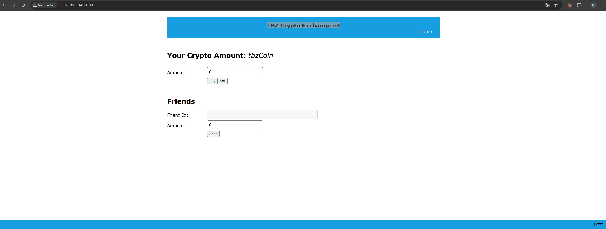
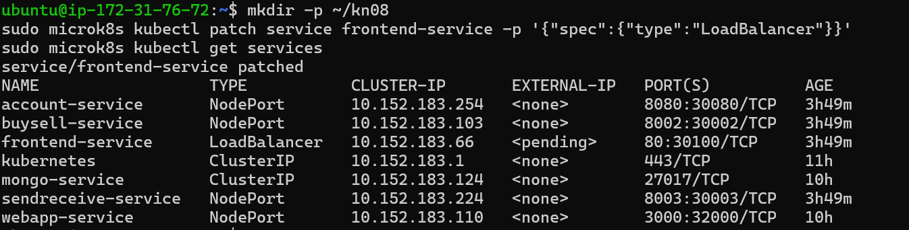

# KN08: Kubernetes III - Microservices

## Uebersicht

In diesem Auftrag wurde eine Microservice-Applikation fuer eine Crypto-Exchange-Plattform (tbzCoin) implementiert und in Kubernetes deployt.

**Was ist eine Microservice-Architektur?**
Statt einer grossen Applikation (Monolith) wird die Anwendung in kleine unabhaengige Services aufgeteilt. Jeder Service hat eine spezifische Aufgabe und kommuniziert mit den anderen ueber HTTP-Anfragen. Das hat den Vorteil dass jeder Service unabhaengig deployt, skaliert und aktualisiert werden kann.

Die Applikation besteht aus 4 Microservices:

- **Frontend** (React App) - die Benutzeroberflaeche im Browser, vorgegeben vom Lehrer
- **Account** (.NET Service) - verwaltet Benutzerkonten und Crypto-Bestaende, vorgegeben, einziger Service der mit der Datenbank kommuniziert
- **BuySell** (Node.js) - selbst implementiert, ermoeglicht Kauf und Verkauf von tbzCoins
- **SendReceive** (Node.js) - selbst implementiert, ermoeglicht das Senden von tbzCoins an Freunde

---

## Cluster Informationen

Der Kubernetes Cluster besteht aus 3 AWS EC2 Instanzen.

**Was ist AWS EC2?**
EC2 steht fuer Elastic Compute Cloud. Das sind virtuelle Maschinen die in der Amazon Cloud laufen. Man mietet sozusagen einen Computer bei Amazon - man bezahlt nur fuer die Zeit die man ihn benutzt.

**Was ist MicroK8s?**
MicroK8s ist eine leichtgewichtige Kubernetes-Distribution von Canonical (Ubuntu). Es ist einfacher zu installieren als normales Kubernetes und eignet sich gut fuer Lernzwecke.

| Node | Private IP | Oeffentliche IP |
|------|------------|-----------------|
| node1 | 172.31.76.72 | 44.200.165.119 |
| node2 | 172.31.73.162 | 3.235.40.227 |
| node3 | 172.31.71.83 | 3.238.182.134 |

Die private IP ist die Adresse innerhalb des AWS-Netzwerks. Die oeffentliche IP ist die Adresse ueber die man von aussen zugreifen kann.

---

## Schritt 1: Datenbank erstellen (AWS RDS)

**Was ist AWS RDS?**
RDS steht fuer Relational Database Service. Es ist ein verwalteter Datenbankdienst von Amazon. "Verwaltet" bedeutet: Amazon kuemmert sich um den Server, Betriebssystem, Updates, Backups und Verfuegbarkeit. Man konfiguriert nur die Datenbank selbst.

**Warum MariaDB?**
MariaDB ist kompatibel mit MySQL und kostenlos. Es ist eine relationale Datenbank - das bedeutet Daten werden in Tabellen mit Zeilen und Spalten gespeichert.

Einstellungen:
- **DB Identifier** `kn08-db` - der Name der Datenbankinstanz in AWS
- **Engine: MariaDB** - das Datenbanksystem
- **Template: Free tier** - kostenlose Option mit eingeschraenkten Ressourcen, reicht fuer Lernzwecke
- **Public access: Yes** - die Datenbank ist von aussen erreichbar, notwendig damit unsere lokalen Tools und die Nodes darauf zugreifen koennen


Die Datenbank ist bereit wenn der Status **Verfuegbar** zeigt.

**Was ist ein Endpoint?**
Der Endpoint ist die Adresse (Hostname) ueber die man die Datenbank erreicht. Er sieht aus wie eine URL: `kn08-db.c36osqe2crs9.us-east-1.rds.amazonaws.com`

- `kn08-db` - Name der Instanz
- `c36osqe2crs9` - eindeutiger Identifier den AWS generiert
- `us-east-1` - die AWS Region (Nord-Virginia, USA)
- `rds.amazonaws.com` - der AWS RDS Domain


### SQL-Script einspielen

Das SQL-Script initialisiert die Datenbank mit den Tabellen und Beispieldaten.

```bash
mysql -h kn08-db.c36osqe2crs9.us-east-1.rds.amazonaws.com -P 3306 -u admin -p < ~/m347kn08/database/m347_KN08_DB.sql
```

**Erklaerung des Befehls Wort fuer Wort:**
- `mysql` - das MySQL/MariaDB Kommandozeilenprogramm
- `-h kn08-db.c36osqe2crs9.us-east-1.rds.amazonaws.com` - `-h` steht fuer "host", danach kommt die Adresse der Datenbank
- `-P 3306` - `-P` steht fuer "Port", 3306 ist der Standard-Port fuer MySQL/MariaDB
- `-u admin` - `-u` steht fuer "user", wir verbinden uns als Benutzer "admin"
- `-p` - Passwort wird interaktiv abgefragt (aus Sicherheitsgruenden nicht direkt im Befehl)
- `<` - Eingabe-Umleitung: statt Tastatureingabe wird der Inhalt der Datei verwendet
- `~/m347kn08/database/m347_KN08_DB.sql` - Pfad zur SQL-Datei, `~` steht fuer das Home-Verzeichnis des aktuellen Benutzers

Zur Kontrolle wurden die Tabellen und Daten abgefragt:

```sql
USE m347kn08;         -- Waehlt die Datenbank "m347kn08" aus
SHOW TABLES;          -- Listet alle Tabellen in der ausgewaehlten Datenbank auf
SELECT * FROM users;  -- Waehlt alle Spalten (*) und alle Zeilen aus der Tabelle "users"
SELECT * FROM friends;-- Waehlt alle Spalten (*) und alle Zeilen aus der Tabelle "friends"
```


Die Datenbank enthaelt zwei Tabellen:
- `users` - Benutzer mit ID, Name und Anzahl tbzCoins. User 1 (Rene) hat 30 tbzCoins.
- `friends` - Freundschaftsbeziehungen zwischen Benutzern, gespeichert als Paare von User-IDs

---

## Schritt 2: Frontend builden und containerisieren

**Was ist React?**
React ist ein JavaScript-Framework von Facebook/Meta fuer Benutzerinterfaces. Der Code muss vor der Verwendung "gebaut" werden - dabei wird der Quellcode in optimierte Dateien umgewandelt die der Browser laden kann.

**Was sind Environment-Variablen?**
Environment-Variablen sind Konfigurationswerte die von aussen in die Anwendung uebergeben werden. So muss man URLs nicht direkt im Code aendern wenn sich die Umgebung aendert. Bei React werden diese beim Build fest in den JavaScript-Code eingebettet.

```
REACT_APP_ACCOUNT_HOLDINGS=http://44.200.165.119:30080/Account/Cryptos/?userid=<userId>
REACT_APP_ACCOUNT_FRIENDS=http://44.200.165.119:30080/Account/Friends/?userid=<userId>
REACT_APP_BUYSELL_BUY=http://44.200.165.119:30002/buy
REACT_APP_BUYSELL_SELL=http://44.200.165.119:30002/sell
REACT_APP_SENDRECEIVE_SEND=http://44.200.165.119:30003/send
REACT_APP_USER_LOGGED_IN=1
```

**Erklaerung der URLs:**
- `http://44.200.165.119` - IP-Adresse von Node 1
- `:30080` - Port des Account-Service NodePort
- `/Account/Cryptos/` - der Pfad des Endpoints beim Account Service
- `?userid=<userId>` - URL-Parameter mit der Benutzer-ID

Build- und Push-Prozess:

```bash
npm install
```
**Erklaerung:** `npm` steht fuer "Node Package Manager". `install` laedt alle Abhaengigkeiten (externe Pakete/Bibliotheken) herunter die im `package.json` definiert sind und speichert sie im Ordner `node_modules`.

```bash
npm run build
```
**Erklaerung:** Fuehrt das Skript "build" aus das in `package.json` definiert ist. Es kompiliert und optimiert den React-Code und erstellt statische HTML/CSS/JS-Dateien im Ordner `/build`.

```bash
docker build -t michaeleatontbz/kn08-frontend:v1 .
```
**Erklaerung Wort fuer Wort:**
- `docker build` - erstellt ein neues Docker Image
- `-t` - steht fuer "tag", gibt dem Image einen Namen
- `michaeleatontbz/kn08-frontend:v1` - der Name: `michaeleatontbz` ist der Docker Hub Benutzername, `kn08-frontend` ist der Image-Name, `v1` ist die Version (Tag)
- `.` - der Punkt bedeutet "aktuelles Verzeichnis" - Docker sucht hier nach dem `Dockerfile`

```bash
docker push michaeleatontbz/kn08-frontend:v1
```
**Erklaerung:** `push` laedt das lokale Image auf Docker Hub hoch. Docker Hub ist eine oeffentliche Registry fuer Container-Images - vergleichbar mit GitHub aber fuer Docker Images. Kubernetes laedt das Image von dort herunter wenn ein Pod gestartet wird.


---

## Schritt 3: Account-Komponente containerisieren

Der Account Service ist in .NET geschrieben. .NET ist ein Framework von Microsoft fuer die Entwicklung von Anwendungen. Der Service wurde vom Lehrer vorgegeben.

Die `appsettings.json` ist die Konfigurationsdatei fuer .NET-Anwendungen. Der ConnectionString ist eine Zeichenkette die alle noetigen Informationen fuer die Datenbankverbindung enthaelt:

```json
{
  "ConnectionString": "Server=kn08-db.c36osqe2crs9.us-east-1.rds.amazonaws.com;Database=m347kn08;User ID=admin;Password=Admin1234!;"
}
```

**Erklaerung des ConnectionStrings:**
- `Server=...` - Adresse des Datenbankservers
- `Database=m347kn08` - Name der Datenbank
- `User ID=admin` - Benutzername
- `Password=Admin1234!` - Passwort

```bash
docker build -t michaeleatontbz/kn08-account:v1 .
docker push michaeleatontbz/kn08-account:v1
```


---

## Schritt 6: BuySell und SendReceive implementieren

**Was ist Node.js?**
Node.js ist eine JavaScript-Laufzeitumgebung die auf dem Server laeuft. Normalerweise laeuft JavaScript nur im Browser - Node.js macht es moeglich JavaScript auch auf dem Server auszufuehren.

**Was ist Express?**
Express ist ein minimales Web-Framework fuer Node.js. Es vereinfacht das Erstellen von HTTP-Servern und das Definieren von Endpoints (Routen).

**Was ist Axios?**
Axios ist eine Bibliothek fuer HTTP-Anfragen. Damit kann ein Service andere Services aufrufen - in diesem Fall ruft BuySell den Account Service auf.

### BuySell Service

```javascript
const express = require('express');   // Express laden
const axios = require('axios');       // Axios laden
const app = express();                // Express-App erstellen
app.use(express.json());              // JSON-Parsing aktivieren - damit koennen wir JSON-Daten empfangen

const ACCOUNT_URL = process.env.ACCOUNT_URL || 'http://localhost:8080';
// process.env.ACCOUNT_URL liest die Umgebungsvariable ACCOUNT_URL
// || 'http://localhost:8080' bedeutet: falls die Variable nicht gesetzt ist, verwende diesen Standardwert

app.post('/buy', async (req, res) => {
  // app.post definiert einen Endpoint der POST-Anfragen auf dem Pfad /buy verarbeitet
  // async bedeutet die Funktion ist asynchron - sie kann auf Antworten warten ohne den Server zu blockieren
  // req = Request (Anfrage), res = Response (Antwort)
  const { id, amount } = req.body;
  // Destrukturierung: id und amount werden aus dem Anfrage-Body extrahiert
  const response = await axios.post(`${ACCOUNT_URL}/Account/Cryptos/Add`, { userId: id, amount: amount });
  // await wartet auf die Antwort des Account Service
  // Template-String mit ${} fuer die URL
  res.json(response.data);
  // Sendet die Antwort des Account Service als JSON zurueck
});

app.post('/sell', async (req, res) => {
  const { id, amount } = req.body;
  const balanceRes = await axios.get(`${ACCOUNT_URL}/Account/Cryptos/?userid=${id}`);
  // GET-Anfrage um den aktuellen Kontostand abzufragen
  const currentBalance = balanceRes.data.amount;
  const actualAmount = currentBalance >= amount ? amount : currentBalance;
  // Ternary Operator: falls genug Coins vorhanden sind, verkaufe den gewuenschten Betrag
  // sonst verkaufe nur was vorhanden ist (setzt Konto auf 0)
  const response = await axios.post(`${ACCOUNT_URL}/Account/Cryptos/Subtract`, { userId: id, amount: actualAmount });
  res.json(response.data);
});

app.listen(8002, () => console.log('BuySell running on port 8002'));
// Startet den Server auf Port 8002
// Der Callback () => console.log(...) wird ausgefuehrt sobald der Server bereit ist
```

### SendReceive Service

```javascript
app.post('/send', async (req, res) => {
  const { id, receiverId, amount } = req.body;
  // id = Sender, receiverId = Empfaenger, amount = Betrag

  const friendsRes = await axios.get(`${ACCOUNT_URL}/Account/Friends/?userid=${id}`);
  // Freundesliste des Senders vom Account Service laden
  
  const isFriend = friendsRes.data.some(f => f.id === receiverId);
  // .some() prueft ob mindestens ein Element die Bedingung erfuellt
  // Hier: ob ein Freund die gleiche ID wie der Empfaenger hat
  
  if (!isFriend) return res.status(400).json({ error: 'Not a friend' });
  // Falls kein Freund: Fehler 400 (Bad Request) zurueckgeben und Funktion beenden

  const balanceRes = await axios.get(`${ACCOUNT_URL}/Account/Cryptos/?userid=${id}`);
  if (balanceRes.data.amount < amount) return res.status(400).json({ error: 'Not enough coins' });
  // Falls nicht genug Coins: Fehler zurueckgeben

  await axios.post(`${ACCOUNT_URL}/Account/Cryptos/Subtract`, { userId: id, amount });
  // Coins beim Sender abziehen
  await axios.post(`${ACCOUNT_URL}/Account/Cryptos/Add`, { userId: receiverId, amount });
  // Coins beim Empfaenger gutschreiben

  res.json({ success: true });
});
```

---

## Schritt 7: Kubernetes Deployment

### ConfigMap

**Was ist eine ConfigMap?**
Eine ConfigMap ist ein Kubernetes-Objekt das Konfigurationsdaten als Key-Value-Paare speichert. Der Vorteil: Konfiguration ist vom Code getrennt. Man kann die Konfiguration aendern ohne ein neues Docker Image zu bauen. Kubernetes injiziert diese Werte als Umgebungsvariablen in die Container beim Start.

```yaml
apiVersion: v1          # Version der Kubernetes API
kind: ConfigMap         # Typ des Objekts
metadata:
  name: crypto-config   # Name der ConfigMap - so wird sie referenziert
data:
  ACCOUNT_URL: "http://account-service:8080"
  # Key: ACCOUNT_URL
  # Value: http://account-service:8080
```

**Warum ist `http://account-service:8080` korrekt?**
Kubernetes hat ein internes DNS-System. Jeder Service ist innerhalb des Clusters unter seinem Namen erreichbar. Der Account Service heisst `account-service` (definiert in `metadata.name` der Service-Definition) und laeuft auf Port 8080. Kubernetes loest `account-service` automatisch zur internen Cluster-IP auf.

### Deployments und Services

**Was ist ein Deployment?**
Ein Deployment ist ein Kubernetes-Objekt das den gewuenschten Zustand der Anwendung beschreibt. Es definiert welches Image verwendet wird, wie viele Replicas laufen sollen und wie die Container konfiguriert sind. Kubernetes sorgt staendig dafuer dass dieser Zustand eingehalten wird - faellt ein Pod aus, startet Kubernetes automatisch einen neuen.

**Was ist ein Service?**
Ein Service ist eine stabile Netzwerkadresse vor den Pods. Das Problem: Pods koennen sterben und neu starten. Dabei aendert sich ihre IP-Adresse. Andere Services wuerden dann die Verbindung verlieren. Der Kubernetes Service hat immer die gleiche IP und leitet Traffic an die richtigen Pods weiter.

**NodePort vs ClusterIP:**
- `NodePort` - der Service ist von aussen erreichbar. Kubernetes oeffnet einen Port auf jedem Node. Erreichbar ueber `<Node-IP>:<NodePort>`
- `ClusterIP` - der Service ist nur innerhalb des Clusters erreichbar. Standard-Typ wenn kein Typ angegeben wird.

```yaml
apiVersion: apps/v1     # API-Version fuer Deployments
kind: Deployment        # Typ: Deployment
metadata:
  name: account         # Name des Deployments
spec:
  replicas: 1           # Wie viele Pod-Instanzen sollen laufen
  selector:
    matchLabels:
      app: account      # Welche Pods gehoeren zu diesem Deployment (ueber Label)
  template:             # Blueprint fuer die Pods
    metadata:
      labels:
        app: account    # Label des Pods - muss mit selector.matchLabels uebereinstimmen
    spec:
      containers:
      - name: account           # Name des Containers
        image: michaeleatontbz/kn08-account:v1  # Docker Image
        ports:
        - containerPort: 8080   # Port auf dem der Container lauscht
---                     # Trenner zwischen zwei Kubernetes-Objekten in einer Datei
apiVersion: v1
kind: Service
metadata:
  name: account-service  # Name des Services - wird fuer DNS verwendet
spec:
  selector:
    app: account         # Welche Pods soll der Service ansprechen (ueber Label)
  ports:
  - port: 8080           # Port des Services (intern im Cluster)
    targetPort: 8080     # Port des Containers (wo die App lauscht)
    nodePort: 30080      # Port auf dem Node (von aussen erreichbar)
  type: NodePort         # Service-Typ: von aussen erreichbar
```

`kubectl apply` wendet die YAML-Konfiguration auf den Cluster an:

```bash
sudo microk8s kubectl apply -f configmap.yaml
# apply = anwenden/erstellen/aktualisieren
# -f = file, danach kommt der Dateiname
```

**Erklaerung `microk8s kubectl`:**
- `microk8s` - das MicroK8s Tool
- `kubectl` - das Kubernetes Command Line Interface (CLI)
- `apply` - wendet eine Konfiguration an (erstellt oder aktualisiert Ressourcen)
- `-f configmap.yaml` - `-f` steht fuer "file", danach der Dateiname

```bash
sudo microk8s kubectl get pods
# get = anzeigen
# pods = welche Ressourcen angezeigt werden sollen

sudo microk8s kubectl get services
# services = alle Services anzeigen
```

### Pods laufen auf Node 1


**Erklaerung der Ausgabe:**
- `NAME` - Name des Pods (automatisch generiert aus Deployment-Name + zufaelligem Suffix)
- `READY` - wie viele Container im Pod bereit sind (z.B. 1/1 = 1 von 1 Container laufen)
- `STATUS` - aktueller Status: Running = laeuft, Pending = wartet, ContainerCreating = wird erstellt
- `RESTARTS` - wie oft der Container neu gestartet wurde
- `AGE` - wie lange der Pod schon laeuft

### Pods laufen auf Node 2

Da Kubernetes ein verteiltes System ist sehen alle Nodes die gleichen Pods und Services. Die Konfiguration wird automatisch ueber alle Nodes synchronisiert:


---

## App im Browser aufrufen

Das Frontend ist ueber Port 30100 erreichbar. Kubernetes verteilt Pods automatisch auf die verfuegbaren Nodes. Der Frontend Pod lief initial auf Node 3 (3.238.182.134). Durch Skalieren auf 2 Replicas lief ein weiterer Pod auf Node 1 (44.200.165.119).

### Node 3 (3.238.182.134:30100)


### Node 1 (44.200.165.119:30100)


### App mit Daten


---

## Schritt 8: App Update ohne Downtime

**Was ist ein Rolling Update?**
Ein Rolling Update ist eine Aktualisierungsstrategie bei der neue Pods schrittweise gestartet werden waehrend alte Pods noch laufen. Erst wenn ein neuer Pod bereit ist (Health Check erfolgreich) wird der alte heruntergefahren. So gibt es zu keinem Zeitpunkt eine Unterbrechung des Services - keine Downtime.

Der Titel wurde von "TBZ Crypto Exchange v2" auf "TBZ Crypto Exchange v3" geaendert.

```bash
sudo microk8s kubectl set image deployment/frontend frontend=michaeleatontbz/kn08-frontend:v5
```

**Erklaerung Wort fuer Wort:**
- `set image` - aendert das Image eines Deployments
- `deployment/frontend` - welches Deployment betroffen ist (Typ/Name)
- `frontend=` - Name des Containers im Deployment dessen Image geaendert wird
- `michaeleatontbz/kn08-frontend:v5` - das neue Image mit Version v5

```bash
sudo microk8s kubectl rollout status deployment/frontend
```

**Erklaerung:**
- `rollout status` - zeigt den Fortschritt eines laufenden Updates
- `deployment/frontend` - welches Deployment ueberwacht werden soll
- Der Befehl wartet bis das Update abgeschlossen ist und zeigt dann "successfully rolled out"

```bash
sudo microk8s kubectl get pods
```

### Rollout in Aktion


Man sieht die neuen Pods `frontend-84bd66fcc4` werden gestartet. Kubernetes faehrt den alten Pod erst herunter wenn der neue bereit ist.

### Aktualisiertes Frontend



Der neue Titel "TBZ Crypto Exchange v3" bestaetigt dass das Update erfolgreich war.

---

## Schritt 9: Multistage Dockerfile

Das Dockerfile beschreibt wie ein Docker Image gebaut wird. Ein Multistage Dockerfile hat mehrere Phasen - in diesem Fall wird die App direkt im Docker Build gebaut statt manuell vorher.

```dockerfile
FROM nginx:alpine
# FROM - gibt das Basis-Image an von dem wir starten
# nginx - ein Webserver der statische Dateien ausliefert
# alpine - eine sehr kleine Linux-Distribution (nur ca. 5MB)
# Das vollstaendige Image nginx:alpine ist ca. 20MB gross

COPY app/build/ /usr/share/nginx/html
# COPY - kopiert Dateien vom lokalen Computer ins Image
# app/build/ - der Quellordner mit den gebauten React-Dateien
# /usr/share/nginx/html - der Zielordner wo nginx Dateien ausliefert

EXPOSE 80
# EXPOSE - dokumentiert welcher Port vom Container verwendet wird
# 80 ist der Standard HTTP-Port
```

```bash
docker build -t michaeleatontbz/kn08-frontend:v5 .
docker push michaeleatontbz/kn08-frontend:v5
```


Kubernetes Deployment mit neuem Image aktualisieren:

```bash
sudo microk8s kubectl set image deployment/frontend frontend=michaeleatontbz/kn08-frontend:v5
```

---

## Schritt 10: LoadBalancer

**Das Problem mit NodePort:**
Bisher wurde die App ueber die IP eines bestimmten Nodes aufgerufen. Das ist nicht ideal weil dieser spezifische Node heruntergefahren werden koennte. Dann waere die App nicht mehr erreichbar obwohl andere Nodes noch laufen.

**Was ist ein LoadBalancer?**
Ein LoadBalancer verteilt eingehenden Traffic gleichmaessig auf mehrere Nodes/Pods. Er bietet eine einzige stabile Adresse und leitet Anfragen an verfuegbare Nodes weiter. Faellt ein Node aus, leitet der LoadBalancer Traffic automatisch an andere Nodes um.

```bash
sudo microk8s kubectl patch service frontend-service -p '{"spec":{"type":"LoadBalancer"}}'
```

**Erklaerung Wort fuer Wort:**
- `patch` - aendert einen Teil einer bestehenden Ressource (ohne alles neu anzuwenden)
- `service frontend-service` - welche Ressource geaendert wird (Typ und Name)
- `-p` - steht fuer "patch", danach kommt die Aenderung als JSON
- `'{"spec":{"type":"LoadBalancer"}}'` - JSON-Patch der den Service-Typ auf LoadBalancer aendert

```bash
sudo microk8s kubectl get services
```



**Warum steht EXTERNAL-IP auf `pending`?**
MicroK8s auf EC2 hat keinen integrierten Cloud-LoadBalancer. In AWS EKS (Elastic Kubernetes Service - dem verwalteten Kubernetes von Amazon) wuerde AWS automatisch einen Load Balancer erstellen und eine oeffentliche IP vergeben. Mit MicroK8s muesste man zusaetzlich MetalLB (einen Software-LoadBalancer) oder einen externen LoadBalancer konfigurieren.

---

## Docker Hub Images

Docker Hub ist eine oeffentliche Registry fuer Container-Images - vergleichbar mit GitHub aber fuer Docker Images. Kubernetes laedt die Images von dort herunter wenn ein Pod gestartet wird.

Alle Images wurden unter dem Benutzernamen `michaeleatontbz` gepusht:

- `michaeleatontbz/kn08-frontend:v1` bis `v5` - verschiedene Versionen des Frontends
- `michaeleatontbz/kn08-account:v1` - Account Service
- `michaeleatontbz/kn08-buysell:v1` - BuySell Service
- `michaeleatontbz/kn08-sendreceive:v1` - SendReceive Service

Die Versionierung mit `:v1`, `:v2` etc. erlaubt es jederzeit auf eine aeltere Version zurueckzugehen falls ein Update Probleme verursacht.