# KN08: Kubernetes III - Microservices

## Uebersicht

In diesem Auftrag wurde eine Microservice-Applikation fuer eine Crypto-Exchange-Plattform (tbzCoin) implementiert und in Kubernetes deployt. Die Applikation besteht aus 4 Microservices:

- **Frontend** (React App) - vorgegeben
- **Account** (.NET Service) - vorgegeben
- **BuySell** (Node.js) - selbst implementiert
- **SendReceive** (Node.js) - selbst implementiert

---

## Schritt 1: Datenbank erstellen (AWS RDS)

Die Datenbank wurde als MariaDB-Instanz auf AWS RDS erstellt. AWS RDS ist ein verwalteter Datenbankdienst von Amazon, der es erlaubt Datenbanken ohne eigene Server zu betreiben.

In der AWS Console wurde unter RDS eine neue MariaDB-Instanz mit folgenden Einstellungen erstellt:
- DB Identifier: `kn08-db`
- Engine: MariaDB
- Template: Free tier
- Public access: Yes

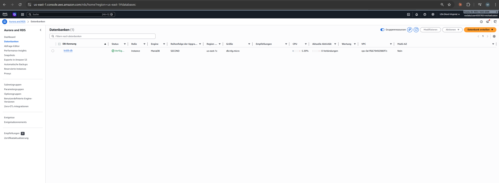

Die Datenbank ist mit Status **Verfuegbar** bereit.

Der Endpoint der Datenbank lautet `kn08-db.c36osqe2crs9.us-east-1.rds.amazonaws.com`:

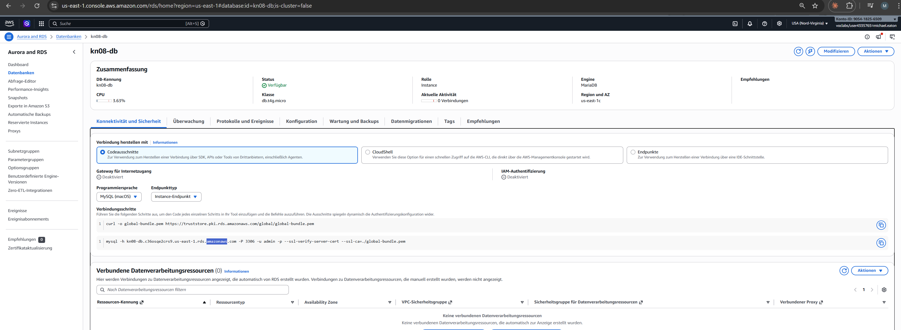

### SQL-Script einspielen

Das initiale SQL-Script wurde auf Node 1 eingespielt. Der folgende Befehl verbindet sich mit der RDS-Datenbank und fuehrt das Script aus:

```bash
mysql -h kn08-db.c36osqe2crs9.us-east-1.rds.amazonaws.com -P 3306 -u admin -p < ~/m347kn08/database/m347_KN08_DB.sql
```

Anschliessend wurde die Datenbank geprueft:

```sql
USE m347kn08;
SHOW TABLES;
SELECT * FROM users;
SELECT * FROM friends;
```

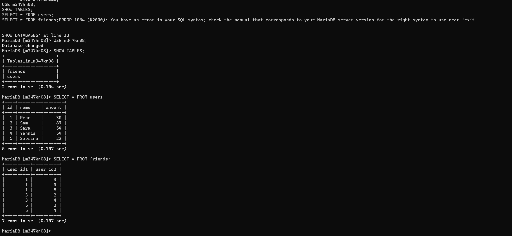

Die Datenbank enthaelt die Tabellen `users` und `friends` mit Beispieldaten. User 1 (Rene) hat 30 tbzCoins.

---

## Schritt 2: Frontend builden und containerisieren

Das Frontend ist eine React-App. Zuerst wurden die Environment-Variablen in `.env.production` gesetzt, damit das Frontend die korrekten Service-URLs verwendet:

```
REACT_APP_ACCOUNT_HOLDINGS=http://192.168.25.132:30080/Account/Cryptos/?userid=<userId>
REACT_APP_ACCOUNT_FRIENDS=http://192.168.25.132:30080/Account/Friends/?userid=<userId>
REACT_APP_BUYSELL_BUY=http://192.168.25.132:30002/buy
REACT_APP_BUYSELL_SELL=http://192.168.25.132:30002/sell
REACT_APP_SENDRECEIVE_SEND=http://192.168.25.132:30003/send
REACT_APP_USER_LOGGED_IN=1
```

Dann wurde die App gebaut und in einen Container gepackt:

```bash
npm install
npm run build
docker build -t michaeleatontbz/kn08-frontend:v1 .
docker push michaeleatontbz/kn08-frontend:v1
```

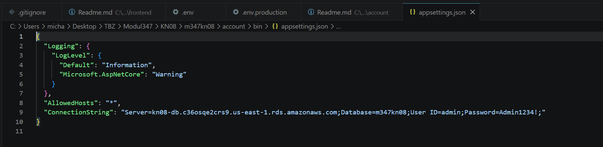

Das Image wurde erfolgreich auf Docker Hub gepusht.

---

## Schritt 3: Account-Komponente containerisieren

Der Account Service ist in .NET geschrieben und bereits vorgegeben. Zuerst wurde die `appsettings.json` mit dem RDS-ConnectionString konfiguriert:

```json
{
  "ConnectionString": "Server=kn08-db.c36osqe2crs9.us-east-1.rds.amazonaws.com;Database=m347kn08;User ID=admin;Password=Admin1234!;"
}
```

Dann wurde der Container gebaut und gepusht:

```bash
docker build -t michaeleatontbz/kn08-account:v1 .
docker push michaeleatontbz/kn08-account:v1
```

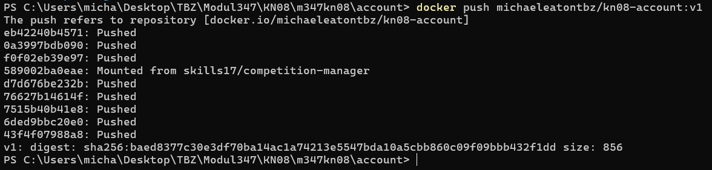

---

## Schritt 4: Test mit Docker Desktop (Frontend + Account)

Bevor alles in Kubernetes deployt wird, wurde das Zusammenspiel von Frontend und Account-Service zuerst lokal mit Docker Desktop getestet. So koennen Fehler frueh erkannt werden.

### Account-Service starten

Der Account-Service wird lokal mit dem RDS-ConnectionString gestartet:

```bash
docker run -d --name account \
  -p 8080:8080 \
  -e ConnectionString="Server=kn08-db.c36osqe2crs9.us-east-1.rds.amazonaws.com;Database=m347kn08;User ID=admin;Password=Admin1234!;" \
  michaeleatontbz/kn08-account:v1
```

### Frontend starten

Das Frontend wird ebenfalls als Container gestartet. Die `.env`-Datei zeigt auf `localhost:8080`:

```bash
docker run -d --name frontend \
  -p 3000:80 \
  michaeleatontbz/kn08-frontend:v1
```

### Test

Im Browser unter `http://localhost:3000` wurde geprueft:
- Die App laedt korrekt
- Die Account-Daten (Holdings und Friends) werden vom Account-Service abgerufen
- Die API-Calls gehen an `localhost:8080` (wie in `.env` konfiguriert)

Das Zusammenspiel zwischen Frontend und Account funktioniert. Der Account-Service verbindet sich erfolgreich mit der AWS RDS Datenbank und gibt die Benutzerdaten zurueck.

---

## Schritt 5: Erster Kubernetes-Test (Frontend + Account)

Nach dem erfolgreichen Docker Desktop Test wurde der naechste Schritt gemacht: nur Frontend und Account in Kubernetes deployen, ohne BuySell und SendReceive.

### Deployment

```bash
microk8s kubectl apply -f configmap.yaml
microk8s kubectl apply -f account.yaml
microk8s kubectl apply -f frontend.yaml
```

### Verifizierung

```bash
microk8s kubectl get pods
microk8s kubectl get services
```

Die Pods laufen und die Services sind erreichbar:
- Frontend: `http://98.93.204.194:30100`
- Account API: `http://98.93.204.194:30080/Account/Cryptos/?userid=1`

Im Browser wurde geprueft, dass das Frontend die Daten vom Account-Service in Kubernetes korrekt laedt. Die Holdings und Friends werden angezeigt. Die BuySell- und SendReceive-Buttons funktionieren noch nicht, da diese Services noch nicht deployt sind.

Erst nachdem dieser Test erfolgreich war, wurden im naechsten Schritt die restlichen Services (BuySell, SendReceive) implementiert und deployt.

---

## Schritt 6: BuySell und SendReceive implementieren

### BuySell Service

Der BuySell Service wurde in Node.js implementiert. Er stellt zwei Endpoints zur Verfuegung:

- `POST /buy` - Kauft tbzCoins fuer einen Benutzer
- `POST /sell` - Verkauft tbzCoins eines Benutzers

```javascript
const express = require('express');
const axios = require('axios');
const app = express();
app.use(express.json());

const ACCOUNT_URL = process.env.ACCOUNT_URL || 'http://localhost:8080';

app.post('/buy', async (req, res) => {
  const { id, amount } = req.body;
  const response = await axios.post(`${ACCOUNT_URL}/Account/Cryptos/Add`, { userId: id, amount: amount });
  res.json(response.data);
});

app.post('/sell', async (req, res) => {
  const { id, amount } = req.body;
  const balanceRes = await axios.get(`${ACCOUNT_URL}/Account/Cryptos/?userid=${id}`);
  const currentBalance = balanceRes.data.amount;
  const actualAmount = currentBalance >= amount ? amount : currentBalance;
  const response = await axios.post(`${ACCOUNT_URL}/Account/Cryptos/Subtract`, { userId: id, amount: actualAmount });
  res.json(response.data);
});

app.listen(8002, () => console.log('BuySell running on port 8002'));
```

### BuySell containerisieren

Das Dockerfile fuer den BuySell Service basiert auf `node:18-alpine` und kopiert nur die notwendigen Dateien:

```dockerfile
FROM node:18-alpine
WORKDIR /app
COPY package.json .
RUN npm install
COPY . .
EXPOSE 8002
CMD ["node", "index.js"]
```

Der Container wurde gebaut und auf Docker Hub gepusht:

```bash
docker build -t michaeleatontbz/kn08-buysell:v1 .
docker push michaeleatontbz/kn08-buysell:v1
```

### SendReceive Service

Der SendReceive Service ermoeglicht das Senden von tbzCoins an Freunde:

- `POST /send` - Sendet tbzCoins an einen Freund

```javascript
const express = require('express');
const axios = require('axios');
const app = express();
app.use(express.json());

const ACCOUNT_URL = process.env.ACCOUNT_URL || 'http://localhost:8080';

app.post('/send', async (req, res) => {
  const { id, receiverId, amount } = req.body;

  const friendsRes = await axios.get(`${ACCOUNT_URL}/Account/Friends/?userid=${id}`);
  const isFriend = friendsRes.data.some(f => f.id === receiverId);
  if (!isFriend) return res.status(400).json({ error: 'Not a friend' });

  const balanceRes = await axios.get(`${ACCOUNT_URL}/Account/Cryptos/?userid=${id}`);
  if (balanceRes.data.amount < amount) return res.status(400).json({ error: 'Not enough coins' });

  await axios.post(`${ACCOUNT_URL}/Account/Cryptos/Subtract`, { userId: id, amount });
  await axios.post(`${ACCOUNT_URL}/Account/Cryptos/Add`, { userId: receiverId, amount });

  res.json({ success: true });
});

app.listen(8003, () => console.log('SendReceive running on port 8003'));
```

### SendReceive containerisieren

Gleiche Struktur wie BuySell, nur anderer Port:

```dockerfile
FROM node:18-alpine
WORKDIR /app
COPY package.json .
RUN npm install
COPY . .
EXPOSE 8003
CMD ["node", "index.js"]
```

Build und Push:

```bash
cd sendreceive
docker build -t michaeleatontbz/kn08-sendreceive:v1 .
docker push michaeleatontbz/kn08-sendreceive:v1
```

Beide Images sind jetzt auf Docker Hub verfuegbar und koennen in Kubernetes deployt werden.

---

## Schritt 7: Kubernetes Deployment

### Kubernetes Secret fuer Datenbank-Credentials

Sensible Daten wie Passwoerter werden in Kubernetes als Secret gespeichert - nicht in einer ConfigMap. Secrets werden Base64-encoded gespeichert und koennen ueber RBAC-Policies geschuetzt werden. Das Secret enthaelt die Zugangsdaten fuer die AWS RDS MariaDB:

```yaml
apiVersion: v1
kind: Secret
metadata:
  name: db-secret
type: Opaque
data:
  db-connection-string: U2VydmVyPWtuMDgtZGIuYzM2b3NxZTJjcnM5LnVzLWVhc3QtMS5yZHMuYW1hem9uYXdzLmNvbTtEYXRhYmFzZT1tMzQ3a24wODtVc2VyIElEPWFkbWluO1Bhc3N3b3JkPUFkbWluMTIzNCE7
```

Der Base64-encodierte Wert enthaelt den Connection String:
```
Server=kn08-db.c36osqe2crs9.us-east-1.rds.amazonaws.com;Database=m347kn08;User ID=admin;Password=Admin1234!;
```

Das Account-Deployment referenziert das Secret ueber `secretKeyRef`, damit die Credentials nicht hardcodiert im Image oder in der ConfigMap stehen:

```yaml
containers:
- name: account
  image: michaeleatontbz/kn08-account:v1
  ports:
  - containerPort: 8080
  env:
  - name: ConnectionString
    valueFrom:
      secretKeyRef:
        key: db-connection-string
        name: db-secret
```

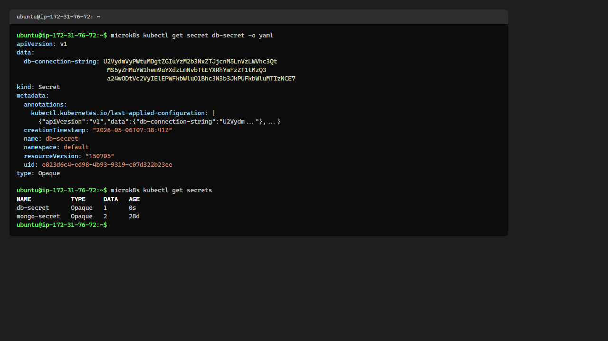

### ConfigMap

Die ConfigMap speichert die URL des Account-Services, damit BuySell und SendReceive ihn finden koennen. Kubernetes injiziert diese Werte als Umgebungsvariablen in die Container:

```yaml
apiVersion: v1
kind: ConfigMap
metadata:
  name: crypto-config
data:
  ACCOUNT_URL: "http://account-service:8080"
```

### Deployments und Services

Fuer jeden Microservice wurde ein Deployment und ein Service erstellt. Das Deployment definiert wie viele Replicas laufen sollen und welches Image verwendet wird. Der Service macht den Pod im Netzwerk erreichbar.

```yaml
apiVersion: apps/v1
kind: Deployment
metadata:
  name: account
spec:
  replicas: 1
  selector:
    matchLabels:
      app: account
  template:
    metadata:
      labels:
        app: account
    spec:
      containers:
      - name: account
        image: michaeleatontbz/kn08-account:v1
        ports:
        - containerPort: 8080
---
apiVersion: v1
kind: Service
metadata:
  name: account-service
spec:
  selector:
    app: account
  ports:
  - port: 8080
    targetPort: 8080
    nodePort: 30080
  type: NodePort
```

### BuySell Deployment mit ConfigMap-Referenz

Das BuySell Deployment zeigt die Verknuepfung zwischen ConfigMap und Container - die Umgebungsvariable `ACCOUNT_URL` wird direkt aus der ConfigMap gelesen:

```yaml
apiVersion: apps/v1
kind: Deployment
metadata:
  name: buysell
spec:
  replicas: 3
  selector:
    matchLabels:
      app: buysell
  template:
    metadata:
      labels:
        app: buysell
    spec:
      containers:
      - name: buysell
        image: michaeleatontbz/kn08-buysell:v1
        ports:
        - containerPort: 8002
        env:
        - name: ACCOUNT_URL
          valueFrom:
            configMapKeyRef:
              key: ACCOUNT_URL
              name: crypto-config
```

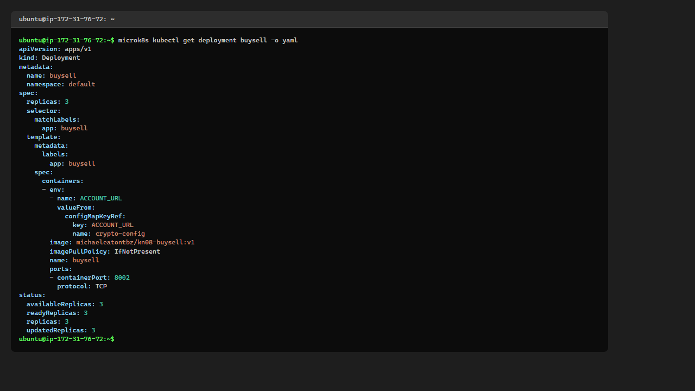

### SendReceive Deployment mit ConfigMap-Referenz

Gleiche Struktur wie BuySell - der SendReceive Service holt sich die Account-URL aus der ConfigMap:

```yaml
apiVersion: apps/v1
kind: Deployment
metadata:
  name: sendreceive
spec:
  replicas: 3
  selector:
    matchLabels:
      app: sendreceive
  template:
    metadata:
      labels:
        app: sendreceive
    spec:
      containers:
      - name: sendreceive
        image: michaeleatontbz/kn08-sendreceive:v1
        ports:
        - containerPort: 8003
        env:
        - name: ACCOUNT_URL
          valueFrom:
            configMapKeyRef:
              key: ACCOUNT_URL
              name: crypto-config
```


### Replicas und Hochverfuegbarkeit

Alle Microservices laufen mit 3 Replicas. Kubernetes verteilt die Pods automatisch auf die 3 Nodes im Cluster. Das bietet Hochverfuegbarkeit, Load Balancing und ermoeglicht Rolling Updates ohne Downtime.

```bash
microk8s kubectl scale deployment account --replicas=3
microk8s kubectl scale deployment buysell --replicas=3
microk8s kubectl scale deployment sendreceive --replicas=3
microk8s kubectl scale deployment frontend --replicas=3
```

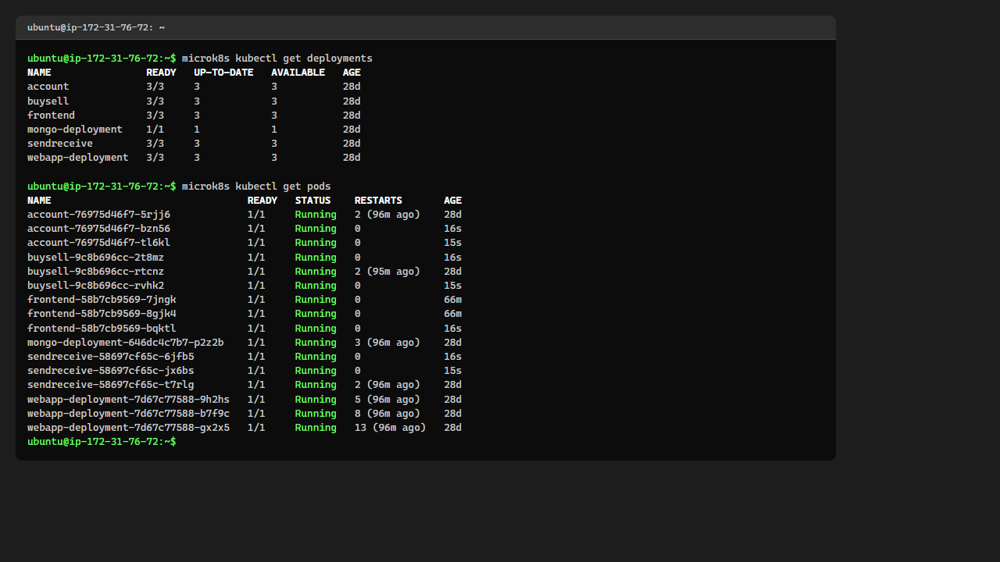

Alle Deployments laufen mit 3/3 Ready.

Alles wurde mit folgendem Befehl in Kubernetes deployt:

```bash
microk8s kubectl apply -f secret.yaml
microk8s kubectl apply -f configmap.yaml
microk8s kubectl apply -f account.yaml
microk8s kubectl apply -f buysell.yaml
microk8s kubectl apply -f sendreceive.yaml
microk8s kubectl apply -f frontend.yaml
```

### Pods laufen auf Node 1

```bash
microk8s kubectl get pods
microk8s kubectl get services
```

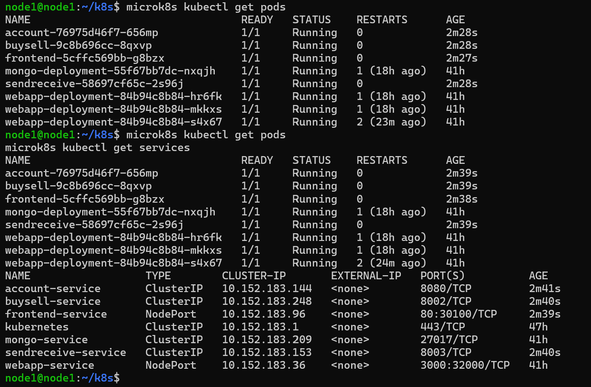

Alle Pods sind im Status `Running`. Die Services sind korrekt konfiguriert mit den richtigen Ports.

### Pods laufen auf Node 2

Da Kubernetes ein verteiltes System ist, sind die Pods und Services auf allen Nodes sichtbar:

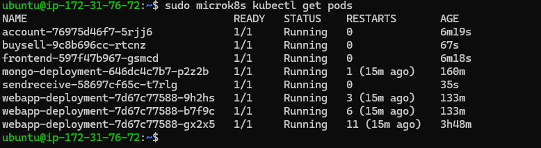

---

## App im Browser aufrufen

Das Frontend ist ueber Port 30100 auf jeder Node erreichbar. Der NodePort-Service leitet den Traffic an den Frontend-Pod weiter.

### Node 1 (98.93.204.194:30100)

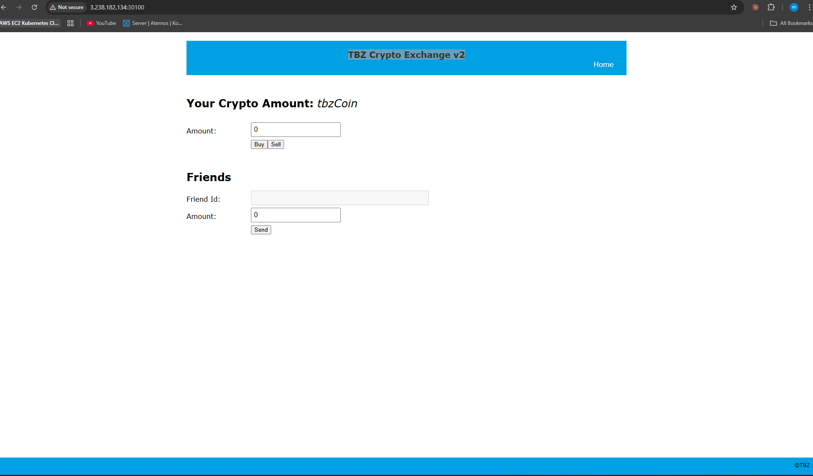

### Node 2 (98.92.50.103:30100)

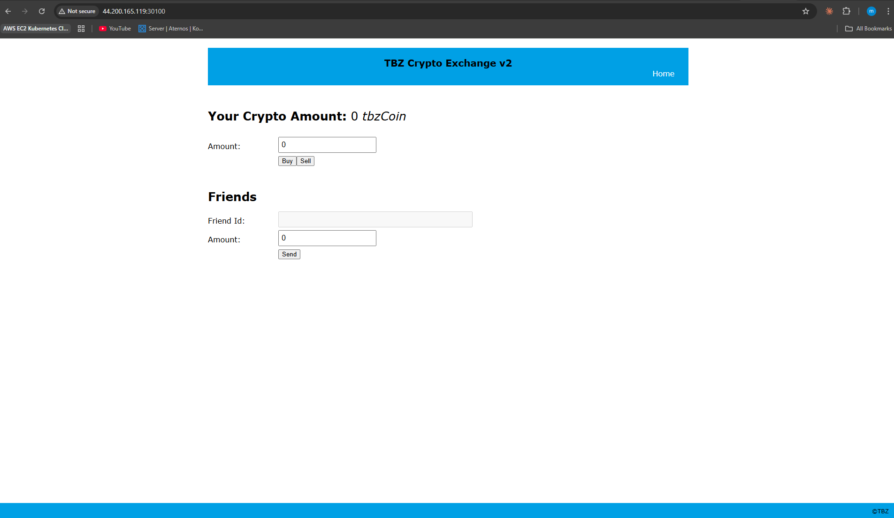

### App mit Daten

Nach dem Anpassen der Environment-Variablen werden die Daten korrekt geladen:

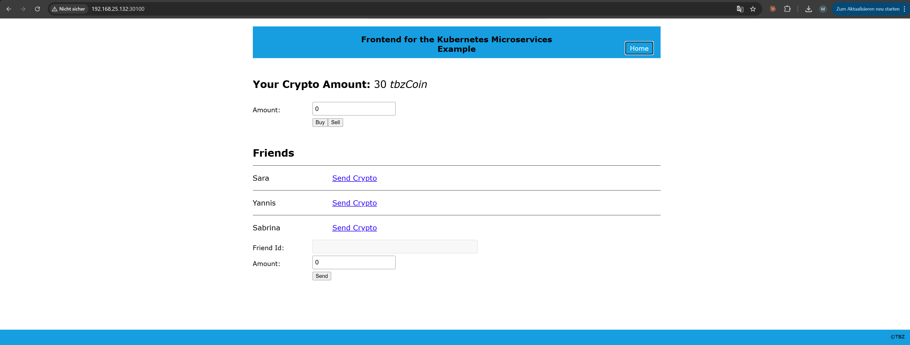

User 1 (Rene) hat 30 tbzCoins und hat Sara, Yannis und Sabrina als Freunde.

---

## Schritt 8: App Update ohne Downtime

Kubernetes ermoeglicht Rolling Updates - alte Pods laufen weiter waehrend neue hochgefahren werden. Der Titel der App wurde geaendert um ein Software-Update zu simulieren.

```bash
microk8s kubectl set image deployment/frontend frontend=michaeleatontbz/kn08-frontend:v3
```

### Rollout in Aktion

```bash
microk8s kubectl get pods
```

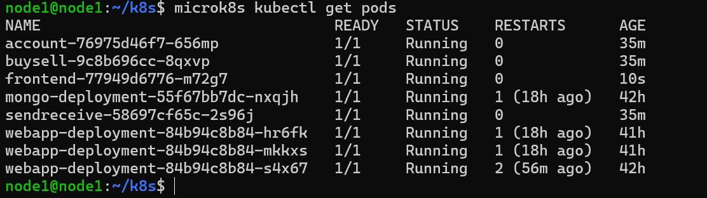

Man sieht den neuen Pod wird gestartet. Kubernetes faehrt den alten Pod erst herunter wenn der neue bereit ist - das garantiert keine Downtime.

### Aktualisiertes Frontend

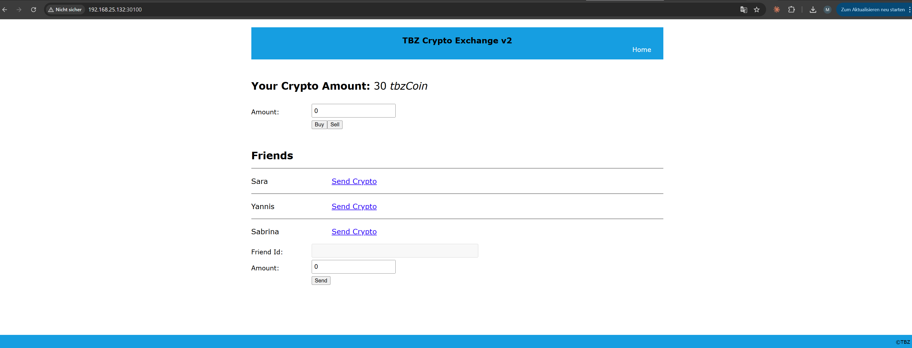

Der neue Titel "TBZ Crypto Exchange v2" ist sichtbar. Die App laeuft weiterhin mit allen Daten.

---

## Schritt 9: Multistage Dockerfile und Dynamic Environment Variables

### Problem mit dem alten Ansatz

Bisher musste `npm run build` manuell ausgefuehrt werden bevor der Container gebaut werden konnte. Ausserdem wurden die Environment-Variablen beim Build hardcodiert in die JavaScript-Dateien eingebaut. Das bedeutete, dass fuer jede Umgebung (Docker Desktop, Kubernetes) ein separater Build noetig war und eine Konfiguration durch Kubernetes nicht moeglich war.

### Multistage Dockerfile

Das Dockerfile wurde auf einen Multistage-Build umgestellt. Die erste Stage baut die React-App, die zweite Stage kopiert nur das fertige Build-Resultat in einen schlanken nginx-Container:

```dockerfile
# Stage 1: Build
FROM node:18-alpine AS build
WORKDIR /app
COPY app/package.json app/package-lock.json ./
RUN npm ci
COPY app/ .
RUN npm run build

# Stage 2: Production
FROM nginx:alpine
WORKDIR /usr/share/nginx/html
RUN rm -rf ./*
COPY --from=build /app/build .
COPY entrypoint.sh /entrypoint.sh
RUN chmod +x /entrypoint.sh
EXPOSE 80
ENTRYPOINT /entrypoint.sh
```

Vorteile des Multistage-Builds:
- Kein lokales `npm install` und `npm run build` mehr noetig
- Das finale Image enthaelt nur nginx + statische Dateien (ca. 25 MB statt 1+ GB mit node_modules)
- Reproduzierbare Builds - egal auf welcher Maschine

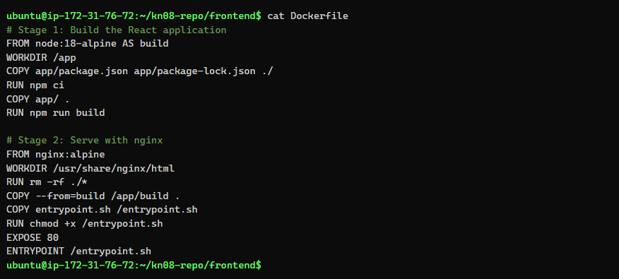

### Dynamic Environment Variables mit entrypoint.sh

Da React beim `npm run build` alle `process.env.REACT_APP_*` Referenzen durch ihre Literalwerte ersetzt, koennen Environment-Variablen nach dem Build nicht mehr durch Kubernetes ueberschrieben werden. Die Loesung:

1. In `.env.production` werden Platzhalter definiert (z.B. `__REACT_APP_BUYSELL_BUY__`)
2. React baut diese Platzhalter-Strings literal in die JS-Dateien ein
3. Beim Container-Start ersetzt `entrypoint.sh` die Platzhalter per `sed` mit den echten Werten aus den Kubernetes-Umgebungsvariablen

Die `.env.production` Datei:

```
REACT_APP_ACCOUNT_HOLDINGS=__REACT_APP_ACCOUNT_HOLDINGS__
REACT_APP_ACCOUNT_FRIENDS=__REACT_APP_ACCOUNT_FRIENDS__
REACT_APP_BUYSELL_BUY=__REACT_APP_BUYSELL_BUY__
REACT_APP_BUYSELL_SELL=__REACT_APP_BUYSELL_SELL__
REACT_APP_SENDRECEIVE_SEND=__REACT_APP_SENDRECEIVE_SEND__
REACT_APP_USER_LOGGED_IN=__REACT_APP_USER_LOGGED_IN__
```

Das `entrypoint.sh` Script:

```sh
#!/bin/sh
set -e
JS_DIR=/usr/share/nginx/html/static/js
replace_var() {
  varname=$1
  varvalue=$2
  if [ -n "$varvalue" ]; then
    for file in $JS_DIR/*.js; do
      sed -i "s|__${varname}__|${varvalue}|g" "$file"
    done
    echo "Replaced __${varname}__ with ${varvalue}"
  fi
}
replace_var REACT_APP_ACCOUNT_HOLDINGS "$REACT_APP_ACCOUNT_HOLDINGS"
replace_var REACT_APP_ACCOUNT_FRIENDS "$REACT_APP_ACCOUNT_FRIENDS"
replace_var REACT_APP_BUYSELL_BUY "$REACT_APP_BUYSELL_BUY"
replace_var REACT_APP_BUYSELL_SELL "$REACT_APP_BUYSELL_SELL"
replace_var REACT_APP_SENDRECEIVE_SEND "$REACT_APP_SENDRECEIVE_SEND"
replace_var REACT_APP_USER_LOGGED_IN "$REACT_APP_USER_LOGGED_IN"
exec nginx -g 'daemon off;'
```

### Environment in den Backend-Komponenten (BuySell & SendReceive)

Im Gegensatz zum Frontend haben BuySell und SendReceive keine Build-Phase die Variablen hardcodiert. Sie lesen `process.env.ACCOUNT_URL` zur Laufzeit direkt. Die Konfiguration kommt aus der ConfigMap via `configMapKeyRef`:

```yaml
# Im BuySell Deployment:
env:
- name: ACCOUNT_URL
  valueFrom:
    configMapKeyRef:
      key: ACCOUNT_URL
      name: crypto-config
```

Der Account-Service erhaelt seinen ConnectionString aus dem Secret:

```yaml
# Im Account Deployment:
env:
- name: ConnectionString
  valueFrom:
    secretKeyRef:
      key: db-connection-string
      name: db-secret
```

So koennen alle Konfigurationswerte zentral in Kubernetes verwaltet werden, ohne Images neu bauen zu muessen.

### Erweiterte ConfigMap

Die ConfigMap wurde mit den Frontend-Variablen ergaenzt. Kubernetes injiziert diese Werte als Umgebungsvariablen in den Container, wo das `entrypoint.sh` Script sie aufnimmt und in die JS-Dateien eintraegt:

```yaml
apiVersion: v1
kind: ConfigMap
metadata:
  name: crypto-config
data:
  ACCOUNT_URL: http://account-service:8080
  REACT_APP_ACCOUNT_HOLDINGS: http://98.93.204.194:30080/Account/Cryptos/?userid=<userId>
  REACT_APP_ACCOUNT_FRIENDS: http://98.93.204.194:30080/Account/Friends/?userid=<userId>
  REACT_APP_BUYSELL_BUY: http://98.92.50.103:30002/buy
  REACT_APP_BUYSELL_SELL: http://98.92.50.103:30002/sell
  REACT_APP_SENDRECEIVE_SEND: http://44.222.167.186:30003/send
  REACT_APP_USER_LOGGED_IN: '1'
```

Das Frontend-Deployment referenziert die ConfigMap via `envFrom`:

```yaml
containers:
- name: frontend
  image: michaeleatontbz/kn08-frontend:v5
  imagePullPolicy: Always
  ports:
  - containerPort: 80
  envFrom:
  - configMapRef:
      name: crypto-config
```

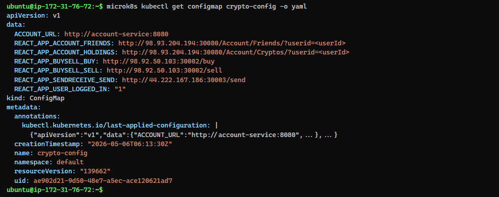

### Build und Deploy

```bash
docker build -t michaeleatontbz/kn08-frontend:v5 ~/kn08-repo/frontend/
docker push michaeleatontbz/kn08-frontend:v5
microk8s kubectl apply -f crypto-config.yaml
microk8s kubectl apply -f frontend-deployment.yaml
microk8s kubectl rollout restart deployment frontend
```

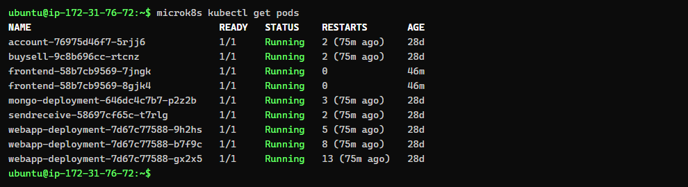

Die Pods laufen und das `entrypoint.sh` ersetzt die Platzhalter korrekt zur Laufzeit, wie in den Pod-Logs bestaetigt:

```
Replaced __REACT_APP_SENDRECEIVE_SEND__ with http://44.222.167.186:30003/send
Replaced __REACT_APP_USER_LOGGED_IN__ with 1
```

---

## Schritt 10: LoadBalancer Service

### Aufgabe

Der Frontend-Service soll von `NodePort` auf `LoadBalancer` umgestellt werden. Ein LoadBalancer-Service provisioniert in einer Cloud-Umgebung automatisch einen externen Load Balancer, der Traffic auf die Pods verteilt.

### Umstellung des Service-Typs

```yaml
apiVersion: v1
kind: Service
metadata:
  name: frontend-service
spec:
  selector:
    app: frontend
  ports:
  - port: 80
    targetPort: 80
    nodePort: 30100
  type: LoadBalancer
```

Anwenden und pruefen:

```bash
microk8s kubectl apply -f frontend-service.yaml
microk8s kubectl get services
```

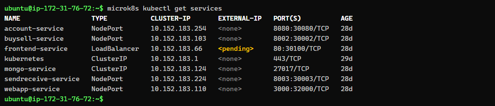

### Warum steht EXTERNAL-IP auf "pending"?

In unserem Setup laeuft microk8s auf normalen AWS EC2-Instanzen (self-managed Kubernetes). Es gibt keinen Cloud Controller Manager, der LoadBalancer-Requests an einen Cloud-Provider weiterleitet. Deshalb bleibt `EXTERNAL-IP` dauerhaft auf `<pending>`.

### Was in AWS EKS passieren wuerde

Auf AWS EKS (Elastic Kubernetes Service) wuerde der Ablauf so aussehen:

1. Kubernetes erkennt den Service-Typ `LoadBalancer`
2. Der **AWS Cloud Controller Manager** (in EKS integriert) erhaelt den Request
3. AWS provisioniert automatisch einen **Network Load Balancer (NLB)** oder **Application Load Balancer (ALB)**
4. Der NLB bekaeme eine oeffentliche DNS-Adresse (z.B. `a1b2c3d4-1234567890.us-east-1.elb.amazonaws.com`)
5. Traffic vom Internet wuerde ueber den NLB an die NodePorts der EKS Worker-Nodes verteilt
6. Health Checks entfernen automatisch ungesunde Nodes aus dem Pool
7. Die EXTERNAL-IP wuerde im `kubectl get services` Output sichtbar werden

Technisch muesste man in EKS nur den Service-Typ aendern und `kubectl apply` ausfuehren - der Rest passiert automatisch. Optional kann man mit Annotations den LoadBalancer-Typ steuern:

```yaml
metadata:
  annotations:
    service.beta.kubernetes.io/aws-load-balancer-type: "nlb"
    service.beta.kubernetes.io/aws-load-balancer-scheme: "internet-facing"
```

### Alternativen fuer microk8s (ohne Cloud-Provider)

- **MetalLB Addon**: Simuliert einen LoadBalancer auf Bare-Metal. Vergibt IP-Adressen aus einem konfigurierten Pool: `microk8s enable metallb:10.64.140.43-10.64.140.49`
- **NodePort weiternutzen**: Die App bleibt ueber `<NodeIP>:30100` auf allen 3 Nodes erreichbar

### Aktuelle Erreichbarkeit

Trotz `<pending>` ist die App ueber den NodePort 30100 auf allen Nodes zugaenglich:
- http://98.93.204.194:30100 (Node 1)
- http://98.92.50.103:30100 (Node 2)
- http://44.222.167.186:30100 (Node 3)

---

## Docker Hub Images

Alle Images wurden auf Docker Hub unter `michaeleatontbz` gepusht:

- `michaeleatontbz/kn08-frontend:v1` bis `v5`
- `michaeleatontbz/kn08-account:v1`
- `michaeleatontbz/kn08-buysell:v1`
- `michaeleatontbz/kn08-sendreceive:v1`

---

## Cluster Informationen

- 3 Nodes mit microk8s auf Ubuntu VMs (AWS EC2 t3.medium)
- Node 1: 98.93.204.194
- Node 2: 98.92.50.103
- Node 3: 44.222.167.186

