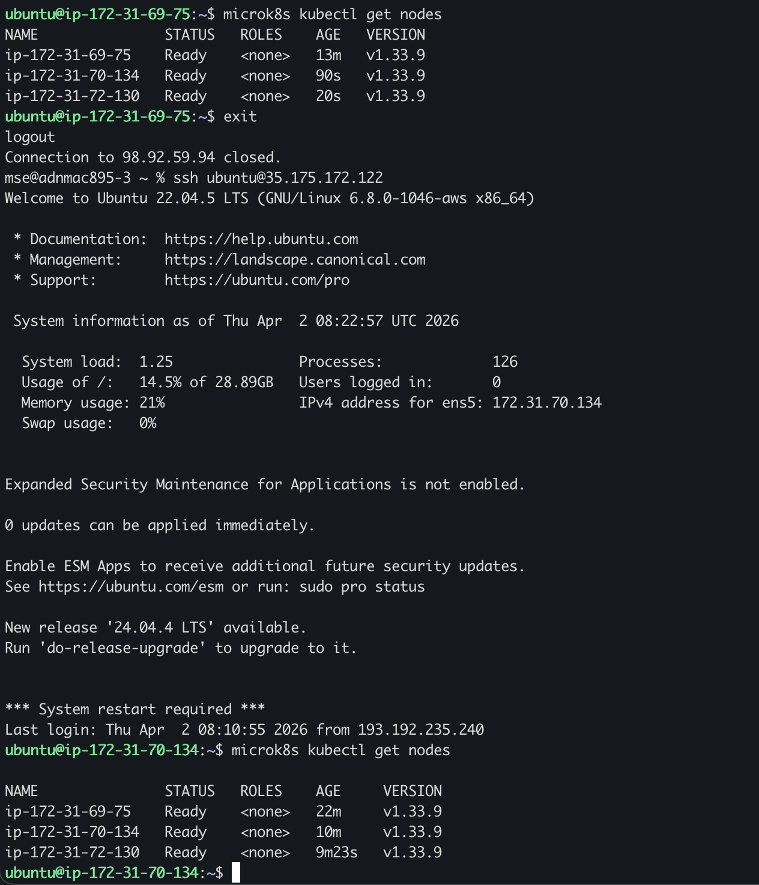
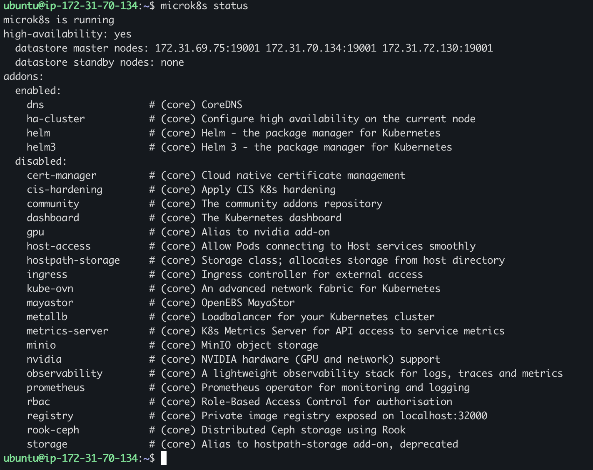
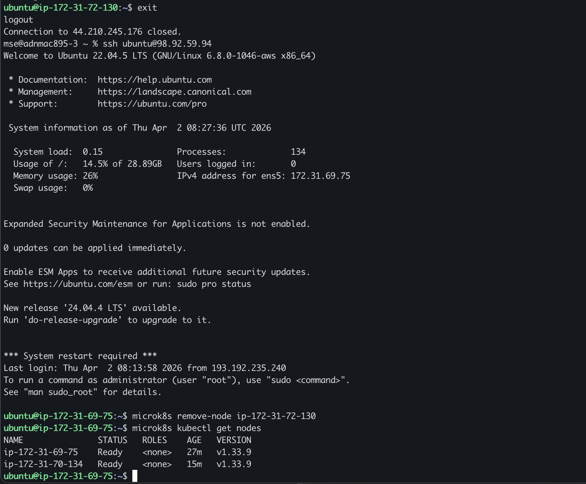
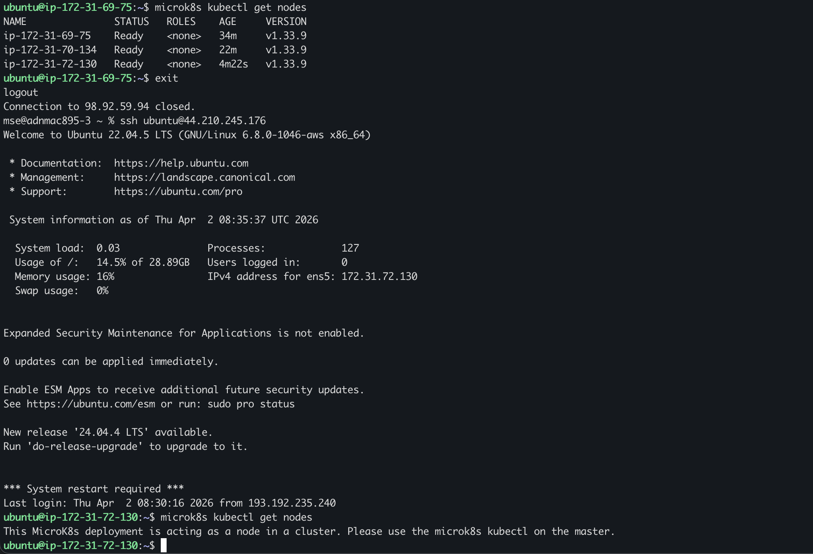

# KN06 – MicroK8s Dokumentation

---

## A) Installation

**Befehl:** `microk8s kubectl get nodes` auf Node 1


Alle drei Nodes sind mit Status `Ready` sichtbar. Der Cluster wurde erfolgreich gebildet.

---

## B) Verständnis für Cluster

### B1 – `get nodes` auf zweitem Node

**Befehl:** `microk8s kubectl get nodes` auf Node 2 (ip-172-31-70-134)



Die Ausgabe ist identisch zu Node 1. Jeder Master-Node kennt den gesamten Cluster-Zustand, da alle auf dieselbe Cluster-Datenbank zugreifen.

---

### B2 – `microk8s status` erklären

**Befehl:** `microk8s status` auf Node 2 (mit allen 3 Nodes als Control-Plane)



| Zeile                           | Bedeutung                                           |
| ------------------------------- | --------------------------------------------------- |
| `microk8s is running`           | MicroK8s läuft korrekt                              |
| `high-availability: yes`        | HA ist aktiv – alle 3 Nodes verwalten die Datenbank |
| `datastore master nodes: ...`   | Alle 3 Nodes sind Datastore-Master                  |
| `datastore standby nodes: none` | Kein reiner Standby nötig, da alle aktiv sind       |

High Availability ist aktiv, weil alle 3 Nodes als vollwertige Control-Plane-Nodes laufen und gemeinsam die Cluster-Datenbank verwalten. Fällt ein Node aus, übernehmen die anderen automatisch.

---

### B3 – Node entfernen

**Befehle auf Node 1:** `microk8s remove-node` und danach `microk8s kubectl get nodes`



`microk8s remove-node ip-172-31-72-130` entfernt Node 3 aus der Cluster-Liste. Danach sind nur noch 2 Nodes sichtbar. (Node 3 wurde zuvor mit `microk8s leave` vom Cluster abgemeldet.)

---

### B4 – Node als Worker wieder hinzufügen

**Befehl auf Node 3:** `microk8s join ... --worker`


Mit `--worker` tritt Node 3 als reiner Arbeits-Node bei. Er führt Pods aus, betreibt aber keinen API-Server und verwaltet keine Cluster-Datenbank. Deshalb schlägt `microk8s kubectl get nodes` auf dem Worker direkt fehl.

---

### B5 – `microk8s status` nach Worker-Join

**Befehl:** `microk8s status` auf Node 1 (nach Worker-Join)


**Vergleich vorher / nachher:**

|                          | Vorher (3× Control-Plane) | Nachher (2× Master, 1× Worker) |
| ------------------------ | ------------------------- | ------------------------------ |
| `high-availability`      | **yes**                   | **no**                         |
| `datastore master nodes` | alle 3 IPs                | nur Node 1                     |

Der Worker verwaltet keine Datenbank – deshalb fällt `high-availability` auf `no`. Für HA braucht es mindestens 3 Datastore-Master.

---

### B6 – `get nodes` auf Master und Worker

**Befehl auf Master (Node 1) und Worker (Node 3):**



Auf dem **Master** funktioniert der Befehl normal und zeigt alle 3 Nodes. Auf dem **Worker** kommt die Fehlermeldung:

```
This MicroK8s deployment is acting as a node in a cluster.
Please use the microk8s kubectl on the master.
```

Der Worker hat keinen lokalen API-Server. Das stimmt mit `microk8s status` überein – nur der Datastore-Master kann Cluster-Informationen liefern.

---

## Unterschied `microk8s` vs `microk8s kubectl`

**`microk8s`** verwaltet die MicroK8s-Software auf dem einzelnen Node (starten, stoppen, Cluster beitreten/verlassen).

**`microk8s kubectl`** verwaltet den laufenden Kubernetes-Cluster (Nodes, Pods, Deployments abfragen). Funktioniert nur auf einem Master-Node.

|                     | `microk8s`                            | `microk8s kubectl`               |
| ------------------- | ------------------------------------- | -------------------------------- |
| Zweck               | Node verwalten                        | Cluster verwalten                |
| Beispiele           | `add-node`, `join`, `leave`, `status` | `get nodes`, `get pods`, `apply` |
| Auf Worker nutzbar? | Ja                                    | Nein                             |
